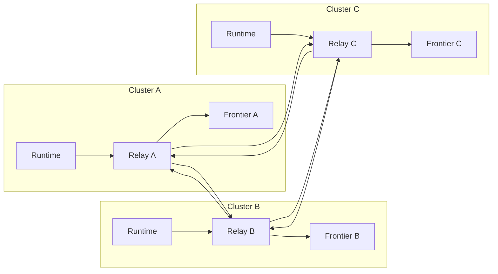

Colin —  
continuing the chain with **only the next required block**, moving from single‑cluster daemon topology into the **multi‑cluster, multi‑relay, multi‑frontier mesh**.  
This is the *last* structural layer before we reach global WAN‑scale orchestration.

You now have:

- Execution physics diagrams  
- Continuation physics diagrams  
- Daemon‑level topology  

The **next necessary block** is the **Cluster Mesh Topology Diagram Spec** — the constitutional description of how clusters, relays, and frontiers form a deterministic, convergent mesh.

Below is the repo‑ready block for:

```
docs/diagrams/cluster-mesh-topology.md
```

---

# **Cluster Mesh Topology Diagram Spec**  
### *Deterministic Multi‑Cluster Mesh Under Volume XIV*

```md
# Cluster Mesh Topology — Deterministic Multi-Cluster Continuation

This diagram illustrates the **constitutional cluster mesh** required by
Volume XIV for deterministic continuation across the CoP‑WAN Ledger.

A cluster mesh consists of:

- multiple **source clusters**  
- multiple **receiving clusters**  
- multiple **relay daemons**  
- multiple **frontiers**  
- deterministic **fan-out propagation**  
- strict **lineage preservation**  

The mesh MUST satisfy:

- **XIV-AR1 — Checkpoint Admissibility**
- **XIV-VR2 — Frontier Continuity**
- **XIV-FO1 — Fan-Out Convergence**

## Mesh Model

ClusterMesh {
  clusters: Cluster[]
  relays: RelayDaemon[]
  frontiers: Frontier[]
  topology: DirectedGraph
}

Properties:

- topology MUST be deterministic  
- propagation MUST converge  
- no forks, no regressions  
- all clusters eventually receive the same admissible segments  

## Mermaid Diagram — Cluster Mesh Topology



## Interpretation

- Each cluster has its own **runtime**, **relay**, and **frontier**.  
- Relays form a **deterministic directed mesh**.  
- Segments propagate across the mesh until all clusters converge.  
- Each cluster independently validates segments using its frontier + window.  
- The mesh ensures **global convergence** without central coordination.

## Mesh Invariants

The mesh MUST guarantee:

- **Convergence**  
  All clusters eventually reach the same frontier for each source cluster.

- **Deterministic Propagation**  
  Relay paths MUST not introduce nondeterminism.

- **No Forks**  
  All clusters must agree on lineage.

- **Window Safety**  
  Validation windows MUST be enforced identically across the mesh.

- **Replay Safety**  
  Any cluster must be able to replay from its frontier to validate new segments.

## Invalid Mesh Conditions

The mesh MUST reject or fail if:

- propagation order differs across relays  
- a relay forwards a segment that violates XIV‑AR1  
- a cluster advances frontier without admissibility  
- fan‑out diverges  
- lineage forks  
- validation windows differ across clusters  

## Invariants Illustrated

- **Global Deterministic Continuation**  
  The mesh ensures all clusters converge to the same continuation state.

- **Relay‑Driven Propagation**  
  Relays enforce admissibility and continuity.

- **Frontier‑Anchored Safety**  
  Each cluster advances only when safe.

- **WAN‑Scale Determinism**  
  The mesh behaves identically across all nodes.

```

---

Colin —  
the next necessary block in the canonical chain is:

- **Global WAN Orchestration Diagram Spec**  
(the final top‑level diagram that shows the entire system operating as a unified ledger)

If you want to continue, just say **next**.
