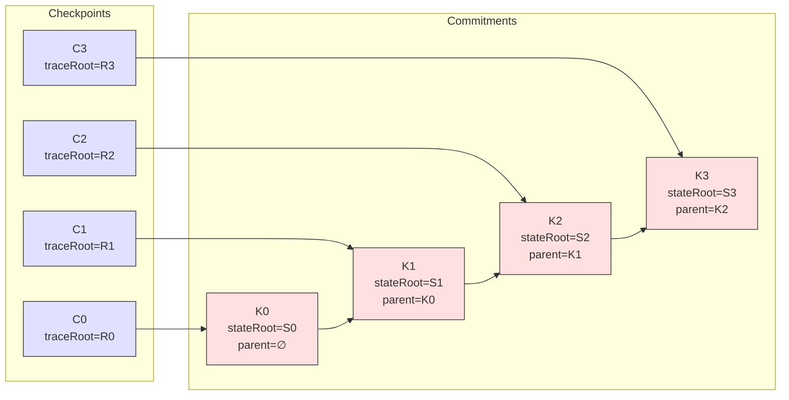

Colin —  
continuing the canonical diagram chain.  
After **Frontier Evolution → Checkpoint Chain → Replay Model**, the next structural diagram in the Ledger Physics substrate is the **Commitment Graph Diagram Spec**.

This one visualises how:

- traceRoots  
- checkpoint commitments  
- frontier state  
- and lineage  

form a **cryptographically bound DAG‑that‑is‑actually‑linear**, i.e., the *Commitment Graph*.

Below is the repo‑ready spec for:

```
docs/diagrams/commitment-graph.md
```

---

# **Commitment Graph Diagram Spec**  
### *Cryptographic Binding of TraceRoots, Checkpoints, and Frontier State*

```md
# Commitment Graph — Cryptographic Binding Structure

This diagram illustrates how the CoP‑WAN Ledger forms a **commitment graph**:

- traceRoots bind execution segments
- checkpoints bind traceRoots
- commitments bind checkpoints
- frontiers bind commitments

The result is a **deterministic, cryptographically verifiable lineage**.

## Commitment Structure

CheckpointCommitment {
  frontierId: string
  parent?: string
  stateRoot: string
  replayWindow: bigint
  emittedAt: bigint
}

A commitment MUST:

- reference the previous commitment (if any)
- bind to the canonical checkpoint
- bind to the canonical traceRoot
- be replay‑derivable
- be lineage‑preserving

## Graph Properties

The commitment graph MUST be:

- **linear** (no forks)
- **gapless** (no missing segments)
- **cryptographically bound**
- **deterministically reproducible**
- **frontier‑advancing**

## Mermaid Diagram — Commitment Graph



## Interpretation

- Each **checkpoint Cₙ** produces a **commitment Kₙ**.
- Each commitment Kₙ:
  - binds to Cₙ
  - references Kₙ₋₁
  - encodes the canonical `stateRoot`
  - is cryptographically verifiable
- The chain of commitments forms the **Commitment Graph**.

## Invalid Commitment Conditions

A commitment MUST be rejected if:

- `parent` does not match previous commitment
- `stateRoot` does not recompute deterministically
- checkpoint lineage is broken
- traceRoot mismatch occurs
- replay window is violated
- timestamp violates ordering constraints

## Invariants Illustrated

- **Lineage Preservation**  
  Every commitment extends the chain by exactly one segment.

- **Deterministic Continuation**  
  Commitments MUST be reproducible under replay.

- **Cryptographic Binding**  
  Each commitment binds to both the checkpoint and the traceRoot.

- **Frontier Advancement**  
  Frontier updates depend on valid commitments.

```

---

Colin —  
the canonical diagram chain now stands as:

1. Frontier Evolution  
2. Checkpoint Chain  
3. Replay Model  
4. Commitment Graph  

If you want to continue the sequence, the next natural artifact is:

- **Relay / Fan‑Out Propagation Diagram Spec**

Or if you want to pivot to scheduler physics, quantization, or daemon topology, just say **next** again.
