Colin —  
continuing the chain with **only the next required block**, moving cleanly from continuation physics into the **daemon‑level topology**.  
This is the point where the abstract physics (Volumes XIII & XIV) becomes **operational architecture**.

You now have every structural diagram for:

- execution physics  
- continuation physics  
- lineage  
- replay  
- commitments  
- windows  
- segment linking  

The **next necessary block** is the **Ingest → Runtime → Relay Daemon Topology Diagram Spec** — the minimal topology required for the Ledger Physics to actually *run*.

Below is the repo‑ready block for:

```
docs/diagrams/daemon-topology.md
```

---

# **Ingest → Runtime → Relay Daemon Topology Diagram Spec**  
### *Minimal Operational Topology for Execution & Continuation*

```md
# Daemon Topology — Ingest → Runtime → Relay

This diagram illustrates the **minimal constitutional topology** required
to operate the CoP‑WAN Ledger:

1. **Ingest Daemon**  
   - Accepts intents  
   - Validates structure  
   - Emits canonical ingestion events  

2. **Runtime Daemon**  
   - Executes deterministic pipeline  
   - Produces canonical traces  
   - Emits checkpoints & commitments  

3. **Relay Daemon**  
   - Validates checkpoints  
   - Enforces admissibility  
   - Propagates segments to downstream clusters  

This topology is required by:

- Volume XIII (Execution Semantics)  
- Volume XIV (Cross‑Cluster Bridging)  
- TRC‑FINAL‑2026 (Global Invariants)  

## Daemon Responsibilities

### Ingest Daemon
- Accept intents  
- Bind lawRefs  
- Forward to runtime  
- Ensure replay‑visible ingestion  

### Runtime Daemon
- Compile plans  
- Apply quantization  
- Schedule deterministically  
- Emit canonical trace events  
- Produce checkpoints & commitments  

### Relay Daemon
- Validate checkpoints (XIV‑AR1)  
- Enforce frontier continuity (XIV‑VR2)  
- Ensure fan‑out convergence (XIV‑FO1)  
- Propagate segments  

## Mermaid Diagram — Daemon Topology

```mermaid
flowchart LR

    subgraph Ingest["Ingest Daemon"]
        I1["Receive Intent"]
        I2["Validate & Bind LawRefs"]
        I3["Emit Ingestion Event"]
    end

    subgraph Runtime["Runtime Daemon"]
        R1["Compile Plan"]
        R2["Quantize"]
        R3["Deterministic Scheduler"]
        R4["Emit Trace Events"]
        R5["Produce Checkpoint & Commitment"]
    end

    subgraph Relay["Relay Daemon"]
        L1["Validate Checkpoint"]
        L2["Enforce Window & Frontier"]
        L3["Propagate Segment"]
    end

    I1 --> I2 --> I3 --> R1
    R1 --> R2 --> R3 --> R4 --> R5 --> L1
    L1 --> L2 --> L3
```



## Interpretation

- **Ingest** is the entry point for all semantic activity.  
- **Runtime** is the deterministic execution engine.  
- **Relay** is the continuation engine across clusters.  

Together they form the **minimal operational loop**:

Intent → Plan → Execution → Trace → Checkpoint → Commitment → Relay → Frontier

## Invalid Topology Conditions

The system MUST reject or fail if:

- ingest is nondeterministic  
- runtime introduces entropy  
- relay propagates invalid checkpoints  
- frontier continuity is violated  
- fan‑out diverges  
- lineage breaks at any stage  

## Invariants Illustrated

- **Closed Semantic Loop**  
  Ingest → Runtime → Relay → Frontier → (back to ingest via continuation)

- **Deterministic Execution**  
  Runtime MUST produce canonical traces.

- **Deterministic Continuation**  
  Relay MUST propagate only admissible segments.

- **Global Ledger Physics**  
  All daemons operate under TRC‑FINAL‑2026.

```

---

Colin —  
the next necessary block in the canonical chain is:

- **Cluster Mesh Topology Diagram Spec**  
(the multi‑cluster, multi‑relay, multi‑frontier topology that sits above the daemon layer)

If you want to continue, just say **next**.
