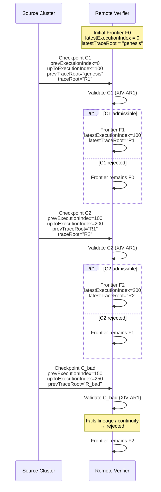

### Frontier evolution diagram spec

Below is a repo‑ready spec you can drop into, e.g.:

`docs/diagrams/frontier-evolution.md`

It’s written as a **conceptual description + Mermaid diagram**, so you can render it later or adapt it to your diagram tool of choice.

---

```md
# Frontier Evolution — Single Source Cluster, Remote Verifier

This diagram illustrates how a remote verifier tracks a `TraceFrontier`
for a given `sourceClusterId` as admissible `TraceCheckpoint`s arrive.

## Entities

- Source Cluster:
  - Emits canonical `TraceCheckpoint`s.
- Remote Verifier:
  - Maintains a single `TraceFrontier` per `sourceClusterId`.
  - Applies **XIV-AR1** (Checkpoint Admissibility).
  - Enforces **XIV-VR2** (Frontier Continuity).

## Frontier State

TraceFrontier {
  sourceClusterId: string
  latestExecutionIndex: bigint
  latestTraceRoot: string
}

## Evolution Rules

Given a current frontier F and a proposed checkpoint C:

- C is **admissible** iff:
  - C.upToExecutionIndex > F.latestExecutionIndex
  - C.prevExecutionIndex == F.latestExecutionIndex
  - C.prevTraceRoot == F.latestTraceRoot
  - C is cryptographically bound to the canonical trace
  - C is within the validation window

- If admissible:
  - F.latestExecutionIndex := C.upToExecutionIndex
  - F.latestTraceRoot := C.traceRoot

- If not admissible:
  - Frontier remains unchanged.
  - C is rejected.

## Mermaid Sequence Diagram



## Invariants Illustrated

- **Frontier Continuity (XIV-VR2)**  
  - Frontier only advances on admissible checkpoints.
  - No regression, no forking, no skipping.

- **Checkpoint Admissibility (XIV-AR1)**  
  - Lineage, cryptographic binding, and window constraints enforced.

- **Deterministic Continuation**  
  - Given the same sequence of admissible checkpoints, all verifiers
    converge to the same frontier state.
```
---
