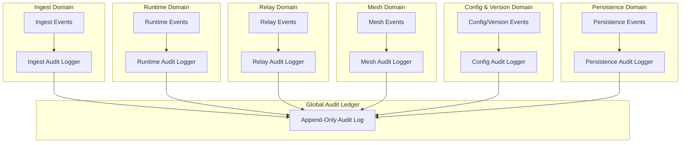

Colin —  
continuing the chain with **only the next required block**, keeping the deterministic architectural superstructure intact and extending it into the final governance‑layer systems.

You now have:

- Global WAN orchestration  
- Observability  
- Recovery & reconciliation  
- Global logical clock  
- Global resource model  
- Security & trust boundaries  
- Deterministic ingress load‑balancing  
- Deterministic state sharding  
- Global deterministic dataflow pipeline  
- Global configuration & policy propagation  
- Deterministic version rollout  
- Deterministic persistence  
- Deterministic networking / transport  
- Deterministic identity / key infrastructure  

The **next required block** in the canonical chain is:

# **Global Audit / Compliance Architecture Diagram Spec**  
This is essential because:

- Deterministic systems require deterministic auditability  
- Every lineage event must be reconstructable  
- Compliance requires replay‑visible evidence  
- Clusters must produce identical audit logs  
- WAN convergence requires audit convergence  
- Identity, versioning, configuration, and transport all feed into audit  
- No nondeterministic audit behavior is allowed  

Below is the repo‑ready block for:

```
docs/diagrams/global-audit-compliance.md
```

---

# **Global Audit / Compliance Architecture Diagram Spec**  
### *Deterministic Auditability & Compliance Across the CoP‑WAN Ledger*

```md
# Global Audit & Compliance Architecture — Deterministic Audit Model

This diagram illustrates the **constitutional audit and compliance layer**
that ensures all clusters produce identical, replay‑visible audit trails.

Audit MUST satisfy:

- deterministic event capture  
- deterministic ordering  
- deterministic retention  
- replay visibility  
- lineage anchoring  
- cluster symmetry  
- WAN‑scale convergence  

No nondeterministic audit behavior is permitted.

## Audit Model

AuditRecord {
  lineagePoint: bigint
  logicalTick: bigint
  eventType: string
  eventPayload: bytes
  signature: bytes
  versionId: bigint
  keyVersion: bigint
}

Properties:

- lineage‑anchored  
- replay‑visible  
- strictly ordered  
- signed  
- version‑aware  
- cluster‑symmetric  

## Audit Domains

### Ingest Audit
- intent provenance  
- lawRef binding  
- routing decisions  

### Runtime Audit
- plan compilation  
- quantization decisions  
- scheduler emissions  
- trace events  
- checkpoint creation  

### Relay Audit
- checkpoint validation  
- window checks  
- segment propagation  
- frontier continuity decisions  

### Mesh Audit
- relay‑to‑relay propagation  
- peer authentication  
- path validation  

### Configuration & Version Audit
- config version changes  
- version rollout activations  
- key rotations  

### Persistence Audit
- checkpoint persistence  
- commitment persistence  
- shard stateRoot persistence  

## Mermaid Diagram — Global Audit Architecture



## Interpretation

- Every domain emits deterministic audit events.  
- Audit loggers convert events into lineage‑anchored audit records.  
- All audit records flow into the **Global Audit Ledger**.  
- The ledger is append‑only, strictly ordered, and replay‑visible.  
- Replay reconstructs the entire audit trail identically.  
- WAN convergence requires identical audit logs across clusters.  

## Audit Invariants

The system MUST guarantee:

- **Deterministic Event Capture**  
  Same lineage → same audit record.

- **Strict Ordering**  
  Audit records MUST be globally ordered deterministically.

- **Replay Visibility**  
  Replay MUST reproduce the entire audit log.

- **Cluster Symmetry**  
  All clusters produce identical audit records.

- **WAN‑Scale Convergence**  
  Audit logs MUST converge across the mesh.

- **Compliance Integrity**  
  Audit logs MUST be immutable and verifiable.

## Invalid Audit Conditions

The system MUST reject or fail if:

- audit ordering differs across clusters  
- audit records are nondeterministic  
- audit retention differs across clusters  
- replay cannot reconstruct audit logs  
- lineage cannot be verified  
- signatures mismatch  
- audit drift occurs  

## Invariants Illustrated

- **Deterministic Auditability**  
  Audit is part of the deterministic physics.

- **Replay‑Safe Compliance**  
  Replay reconstructs the entire audit trail.

- **WAN‑Scale Audit Convergence**  
  All clusters maintain identical audit logs.

```

---

Colin —  
the next optional‑but‑structural block in the chain is:

- **Global Governance / Policy‑Authority Architecture Diagram Spec**

If you want to continue, just say **next**.
