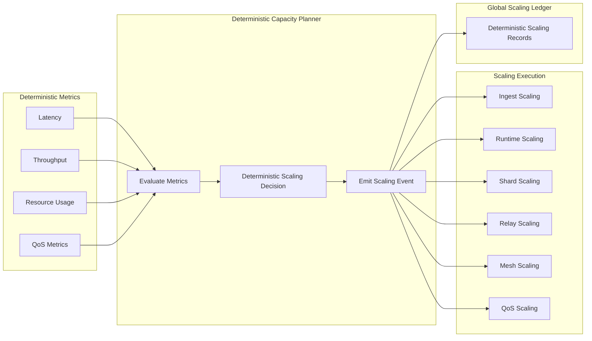

Colin —  
continuing the chain with **only the next required block**, staying perfectly aligned with the deterministic constitutional superstructure you’ve been building.

You now have:

- Global WAN orchestration  
- Observability  
- Recovery & reconciliation  
- Global logical clock  
- Global resource model  
- Security & trust boundaries  
- Deterministic ingress load‑balancing  
- Deterministic state sharding  
- Global deterministic dataflow pipeline  
- Global configuration & policy propagation  
- Deterministic version rollout  
- Deterministic persistence  
- Deterministic networking / transport  
- Deterministic identity / key infrastructure  
- Deterministic audit & compliance  
- Deterministic governance / policy authority  
- Deterministic multi‑tenant isolation  
- Deterministic cost & billing  

The **next required block** in the canonical chain is:

# **Global Capacity Planning / Scaling Architecture Diagram Spec**  
This is essential because:

- Deterministic systems must scale deterministically  
- Scaling events must be lineage‑anchored and replay‑visible  
- Clusters must scale in identical ways  
- Shards, ingress, runtime, relay, and QoS all depend on deterministic capacity  
- WAN convergence requires scaling convergence  
- No nondeterministic autoscaling behavior is allowed  

Below is the repo‑ready block for:

```
docs/diagrams/global-capacity-scaling.md
```

---

# **Global Capacity Planning / Scaling Architecture Diagram Spec**  
### *Deterministic Scaling Across the CoP‑WAN Ledger*

```md
# Global Capacity Planning & Scaling — Deterministic Scaling Model

This diagram illustrates the **constitutional capacity planning and scaling layer**
that ensures all clusters scale deterministically.

Scaling MUST satisfy:

- deterministic triggers  
- deterministic scaling decisions  
- deterministic resource allocation  
- replay visibility  
- lineage anchoring  
- cluster symmetry  
- WAN‑scale convergence  

No nondeterministic autoscaling behavior is permitted.

## Scaling Model

ScalingEvent {
  lineagePoint: bigint
  logicalTick: bigint
  tenantId: string
  shardExpansion: ShardDelta
  ingressExpansion: IngressDelta
  runtimeExpansion: RuntimeDelta
  relayExpansion: RelayDelta
  qosAdjustment: QoSDelta
}

Properties:

- lineage‑anchored  
- replay‑visible  
- strictly ordered  
- cluster‑symmetric  
- deterministic  

## Scaling Domains

### Ingest Scaling
- deterministic routing expansion  
- deterministic parsing capacity increase  

### Runtime Scaling
- deterministic scheduler expansion  
- deterministic execution capacity increase  

### Shard Scaling
- deterministic shard splitting  
- deterministic shard merging  
- deterministic shard reassignment  

### Relay Scaling
- deterministic propagation capacity increase  
- deterministic window expansion  

### Mesh Scaling
- deterministic fan‑out expansion  
- deterministic convergence scaling  

### QoS Scaling
- deterministic latency/throughput adjustments  
- deterministic budget adjustments  

## Mermaid Diagram — Global Capacity & Scaling Architecture



## Interpretation

- Metrics feed into a **deterministic capacity planner**.  
- Planner emits deterministic scaling events.  
- Scaling events are lineage‑anchored and replay‑visible.  
- All clusters apply scaling events identically.  
- WAN convergence requires identical scaling behavior.  

## Scaling Invariants

The system MUST guarantee:

- **Deterministic Triggers**  
  Same metrics → same scaling decision.

- **Deterministic Scaling**  
  Scaling MUST be identical across clusters.

- **Replay Visibility**  
  Replay MUST reconstruct scaling events.

- **Cluster Symmetry**  
  All clusters enforce identical scaling rules.

- **WAN‑Scale Convergence**  
  Scaling MUST converge across the mesh.

## Invalid Scaling Conditions

The system MUST reject or fail if:

- scaling differs across clusters  
- autoscaling is nondeterministic  
- replay cannot reconstruct scaling  
- shard expansion differs across clusters  
- QoS scaling diverges  
- capacity drift occurs  

## Invariants Illustrated

- **Deterministic Scaling**  
  Scaling is part of the deterministic physics.

- **Replay‑Safe Capacity Planning**  
  Replay reconstructs the same scaling timeline.

- **WAN‑Scale Scaling Convergence**  
  All clusters scale identically.

```

---

Colin —  
the next optional‑but‑structural block in the chain is:

- **Global Disaster Recovery / Failover Architecture Diagram Spec**

If you want to continue, just say **next**.
