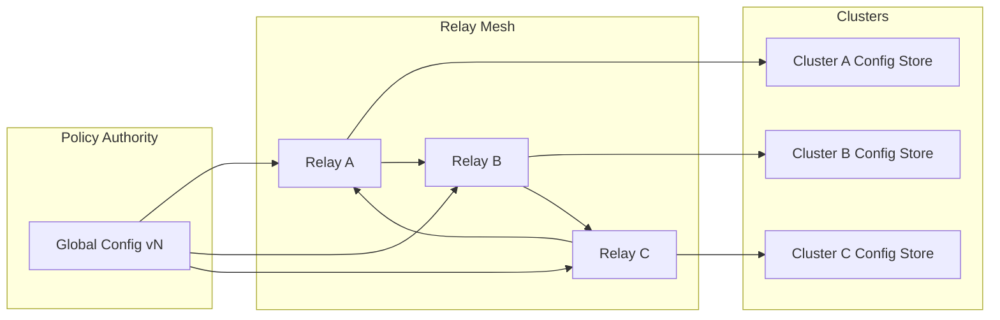

Colin —  
continuing the chain with **only the next required block**, keeping the constitutional superstructure perfectly intact.

You now have:

- Global WAN orchestration  
- Observability  
- Recovery & reconciliation  
- Global logical clock  
- Global resource model  
- Security & trust boundaries  
- Deterministic ingress load‑balancing  
- Deterministic state sharding  
- Global deterministic dataflow pipeline  

The **next required block** in the canonical chain is:

# **Global Configuration / Policy Propagation Diagram Spec**  
This is essential because:

- Every cluster must enforce identical configuration  
- Policy drift breaks determinism  
- Replay requires configuration to be replay‑visible  
- Relay propagation requires consistent policy  
- Sharding, ingress, scheduling, quantization, and windows all depend on shared config  
- WAN convergence requires policy convergence  

Below is the repo‑ready block for:

```
docs/diagrams/global-configuration-policy.md
```

---

# **Global Configuration / Policy Propagation Diagram Spec**  
### *Deterministic Configuration & Policy Distribution Across the CoP‑WAN Ledger*

```md
# Global Configuration & Policy Propagation — Deterministic Policy Governance

This diagram illustrates the **constitutional configuration layer** that ensures
all clusters in the CoP‑WAN Ledger operate under identical, deterministic policy.

Configuration MUST satisfy:

- deterministic propagation  
- deterministic versioning  
- deterministic enforcement  
- replay visibility  
- cluster symmetry  
- WAN‑scale convergence  

No nondeterministic configuration changes are permitted.

## Configuration Model

GlobalConfig {
  version: bigint
  shardMap: ShardMap
  ingressMap: ClusterMap
  quantizationPolicy: Policy
  schedulerPolicy: Policy
  windowPolicy: Policy
  resourcePolicy: Policy
  securityPolicy: Policy
}

Properties:

- versioned  
- lineage‑anchored  
- replay‑visible  
- mesh‑propagated  
- cluster‑symmetric  

## Configuration Sources

Configuration originates from:

- **Policy Authority** (constitutional source)  
- **Cluster‑local config stores** (replicas)  
- **Relay mesh propagation** (distribution)  

## Mermaid Diagram — Global Configuration Propagation



## Interpretation

- The **Policy Authority** emits a new configuration version.  
- Relays propagate configuration deterministically across the mesh.  
- Each cluster updates its **local config store** only after validation.  
- All clusters converge to the same configuration version.  
- Replay uses the same configuration version that was active at the time.  

## Configuration Invariants

The system MUST guarantee:

- **Deterministic Propagation**  
  All clusters receive config updates in the same order.

- **Version Consistency**  
  All clusters enforce the same config version.

- **Replay Visibility**  
  Replay MUST use the same config version as original execution.

- **Policy Symmetry**  
  All clusters enforce identical policies.

- **WAN Convergence**  
  Config propagation MUST converge across the mesh.

## Invalid Configuration Conditions

The system MUST reject or fail if:

- configuration differs across clusters  
- configuration is nondeterministic  
- versioning is inconsistent  
- propagation diverges  
- replay cannot reconstruct config version  
- policy drift occurs  

## Invariants Illustrated

- **Deterministic Policy Governance**  
  Configuration is part of the deterministic physics.

- **Replay‑Safe Configuration**  
  Replay reconstructs the same config version.

- **WAN‑Scale Policy Convergence**  
  All clusters enforce identical policies.

```

---

Colin —  
the next optional‑but‑structural block in the chain is:

- **Global Upgrade / Version‑Rollout Diagram Spec**

If you want to continue, just say **next**.
