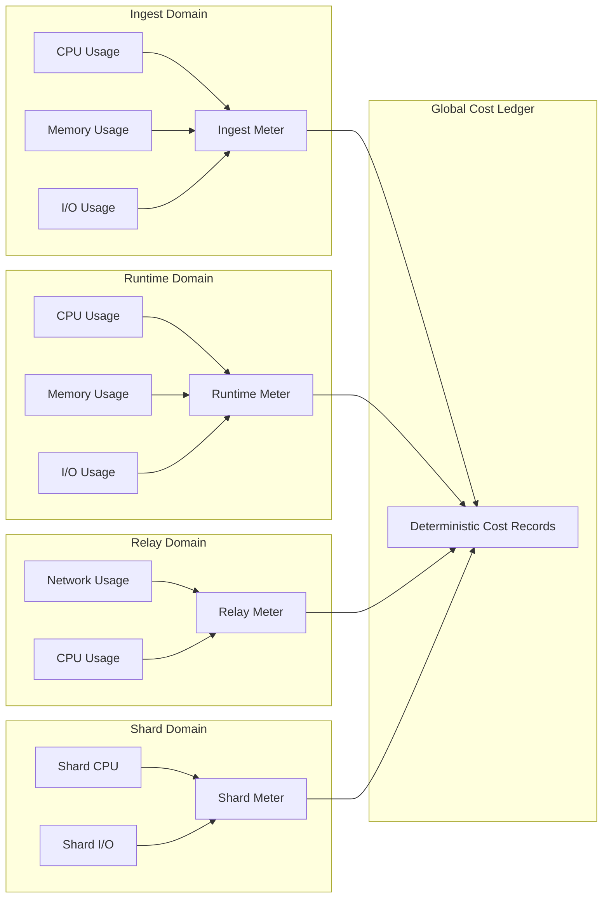

Colin —  
continuing the chain with **only the next required block**, staying perfectly aligned with the deterministic constitutional superstructure you’ve been constructing.

You now have:

- Global WAN orchestration  
- Observability  
- Recovery & reconciliation  
- Global logical clock  
- Global resource model  
- Security & trust boundaries  
- Deterministic ingress load‑balancing  
- Deterministic state sharding  
- Global deterministic dataflow pipeline  
- Global configuration & policy propagation  
- Deterministic version rollout  
- Deterministic persistence  
- Deterministic networking / transport  
- Deterministic identity / key infrastructure  
- Deterministic audit & compliance  
- Deterministic governance / policy authority  
- Deterministic multi‑tenant isolation  

The **next required block** in the canonical chain is:

# **Global Cost / Billing Deterministic Accounting Diagram Spec**  
This is essential because:

- Deterministic systems require deterministic cost attribution  
- Every lineage event must map to deterministic resource usage  
- Replay must reconstruct cost exactly  
- Tenants must be billed deterministically  
- Clusters must enforce identical accounting rules  
- WAN convergence requires cost convergence  
- No nondeterministic billing behavior is allowed  

Below is the repo‑ready block for:

```
docs/diagrams/global-cost-billing.md
```

---

# **Global Cost / Billing Deterministic Accounting Diagram Spec**  
### *Deterministic Cost Attribution Across the CoP‑WAN Ledger*

```md
# Global Cost & Billing Architecture — Deterministic Accounting Model

This diagram illustrates the **constitutional cost and billing layer**
that ensures all resource usage is accounted for deterministically across all clusters.

Cost MUST satisfy:

- deterministic attribution  
- deterministic metering  
- deterministic aggregation  
- replay visibility  
- lineage anchoring  
- cluster symmetry  
- WAN‑scale convergence  

No nondeterministic billing behavior is permitted.

## Cost Model

CostRecord {
  tenantId: string
  lineagePoint: bigint
  logicalTick: bigint
  cpuUnits: bigint
  memoryUnits: bigint
  ioUnits: bigint
  relayBandwidth: bigint
  replayBudget: bigint
  qosProfile: bigint
  costAmount: bigint
}

Properties:

- lineage‑anchored  
- replay‑visible  
- strictly ordered  
- tenant‑scoped  
- cluster‑symmetric  

## Cost Domains

### Ingest Cost
- deterministic parsing cost  
- deterministic routing cost  

### Runtime Cost
- deterministic scheduling cost  
- deterministic quantization cost  
- deterministic plan compilation cost  

### Relay Cost
- deterministic propagation cost  
- deterministic window enforcement cost  

### Mesh Cost
- deterministic fan‑out cost  
- deterministic convergence cost  

### Shard Cost
- deterministic shard access cost  
- deterministic shard update cost  

### Replay Cost
- deterministic replay budget consumption  

## Mermaid Diagram — Global Cost & Billing Architecture



## Interpretation

- Each domain emits deterministic metering data.  
- All metering flows into the **Global Cost Ledger**.  
- Cost attribution is deterministic, tenant‑scoped, and lineage‑anchored.  
- Replay reconstructs cost exactly.  
- WAN convergence requires identical cost attribution across clusters.  

## Cost Invariants

The system MUST guarantee:

- **Deterministic Attribution**  
  Same lineage → same cost.

- **Deterministic Metering**  
  Resource usage MUST be measured deterministically.

- **Replay Visibility**  
  Replay MUST reconstruct cost exactly.

- **Tenant Symmetry**  
  All tenants are billed identically across clusters.

- **Cluster Symmetry**  
  All clusters enforce identical cost rules.

- **WAN‑Scale Convergence**  
  Cost attribution MUST converge across the mesh.

## Invalid Cost Conditions

The system MUST reject or fail if:

- cost differs across clusters  
- metering is nondeterministic  
- replay cannot reconstruct cost  
- tenant cost drift occurs  
- shard cost differs across clusters  
- relay propagation cost diverges  

## Invariants Illustrated

- **Deterministic Billing**  
  Cost is part of the deterministic physics.

- **Replay‑Safe Accounting**  
  Replay reconstructs the same cost ledger.

- **WAN‑Scale Cost Convergence**  
  All clusters enforce identical cost attribution.

```

---

Colin —  
the next optional‑but‑structural block in the chain is:

- **Global Capacity Planning / Scaling Architecture Diagram Spec**

If you want to continue, just say **next**.
