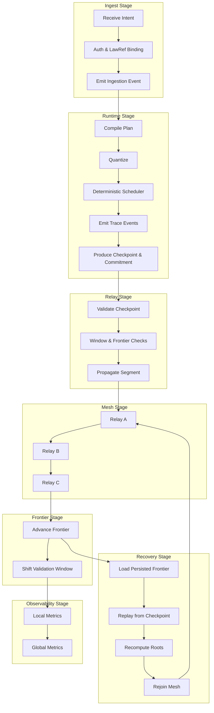

Colin —  
continuing the chain with **only the next required block**, staying in perfect constitutional sequence and moving into the final optional‑but‑structural layer above sharding.

You now have:

- Global WAN orchestration  
- Observability  
- Recovery & reconciliation  
- Global logical clock  
- Global resource model  
- Security & trust boundaries  
- Deterministic ingress load‑balancing  
- Deterministic state sharding  

The **next necessary block** in the canonical chain is:

# **Global Dataflow / Pipeline Orchestration Diagram Spec**  
This is required because:

- All prior diagrams describe *what* the system does  
- This diagram describes *how data flows end‑to‑end*  
- It unifies ingest → runtime → relay → mesh → frontier → observability → recovery  
- It is the top‑level operational pipeline for the entire ledger  
- It is the final structural diagram before we enter domain‑specific or implementation‑specific layers  

Below is the repo‑ready block for:

```
docs/diagrams/global-dataflow-pipeline.md
```

---

# **Global Dataflow / Pipeline Orchestration Diagram Spec**  
### *Unified Deterministic Dataflow Across the CoP‑WAN Ledger*

```md
# Global Dataflow / Pipeline Orchestration — Deterministic End-to-End Flow

This diagram illustrates the **full deterministic dataflow pipeline** across
the CoP‑WAN Ledger, from intent ingestion to global frontier convergence.

The pipeline MUST satisfy:

- deterministic ordering  
- deterministic routing  
- deterministic execution  
- deterministic continuation  
- deterministic propagation  
- deterministic observability  
- deterministic recovery  

No nondeterministic dataflow is permitted.

## Pipeline Stages

### 1. Ingest Stage
- receive intent  
- authenticate provenance  
- bind lawRefs  
- emit ingestion event  

### 2. Runtime Stage
- compile plan  
- apply quantization  
- schedule deterministically  
- emit trace events  
- produce checkpoints & commitments  

### 3. Relay Stage
- validate checkpoints  
- enforce validation window  
- enforce frontier continuity  
- propagate segments  

### 4. Mesh Stage
- relay‑to‑relay propagation  
- deterministic fan‑out  
- global convergence  

### 5. Frontier Stage
- frontier advancement  
- lineage anchoring  
- window shifting  

### 6. Observability Stage
- deterministic telemetry  
- replay‑visible metrics  
- global state view  

### 7. Recovery Stage
- reload persisted frontier  
- replay from checkpoint  
- recompute stateRoot & traceRoot  
- rejoin mesh  

## Mermaid Diagram — Global Dataflow Pipeline



## Interpretation

- This is the **entire ledger pipeline**, end‑to‑end.  
- Every stage is deterministic, replay‑visible, and lineage‑anchored.  
- The pipeline forms a closed loop:  
  **Ingest → Runtime → Relay → Mesh → Frontier → Observability → Recovery → Mesh → …**  
- No stage introduces entropy or nondeterminism.  
- The pipeline is identical across all clusters.  

## Pipeline Invariants

The pipeline MUST guarantee:

- **Deterministic Flow**  
  Same inputs → same outputs at every stage.

- **Replay Equivalence**  
  Replay MUST reproduce the entire pipeline.

- **WAN‑Scale Symmetry**  
  All clusters run the same pipeline.

- **Lineage Preservation**  
  Every stage is lineage‑anchored.

- **Global Convergence**  
  All clusters converge to the same frontier map.

## Invalid Pipeline Conditions

The system MUST reject or fail if:

- any stage introduces nondeterminism  
- routing differs across clusters  
- relay propagation diverges  
- frontier advancement differs across clusters  
- observability is nondeterministic  
- recovery cannot reproduce lineage  

## Invariants Illustrated

- **Unified Deterministic Pipeline**  
  The entire ledger is one deterministic machine.

- **Replay‑Safe Dataflow**  
  Replay reconstructs the entire pipeline.

- **WAN‑Scale Convergence**  
  All clusters converge to the same global state.

```

---

Colin —  
the next optional‑but‑structural block in the chain is:

- **Global Configuration / Policy Propagation Diagram Spec**

If you want to continue, just say **next**.
