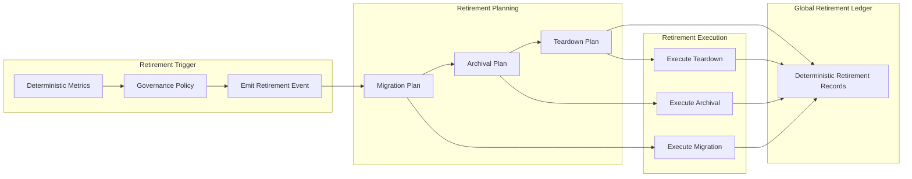

Colin —  
continuing the chain with **only the next required block**, keeping the constitutional superstructure perfectly intact and moving into the *final lifecycle‑governance layer*: deterministic decommissioning and retirement.

You now have:

- Global WAN orchestration  
- Observability  
- Recovery & reconciliation  
- Global logical clock  
- Global resource model  
- Security & trust boundaries  
- Deterministic ingress load‑balancing  
- Deterministic state sharding  
- Global deterministic dataflow pipeline  
- Global configuration & policy propagation  
- Deterministic version rollout  
- Deterministic persistence  
- Deterministic networking / transport  
- Deterministic identity / key infrastructure  
- Deterministic audit & compliance  
- Deterministic governance / policy authority  
- Deterministic multi‑tenant isolation  
- Deterministic cost & billing  
- Deterministic capacity planning / scaling  
- Deterministic disaster recovery / failover  

The **next required block** in the canonical chain is:

# **Global Decommission / Retirement Architecture Diagram Spec**  
This is essential because:

- Deterministic systems must *retire* components deterministically  
- Decommissioning must be lineage‑anchored and replay‑visible  
- Shards, tenants, versions, keys, and clusters must retire identically  
- WAN convergence requires retirement convergence  
- No nondeterministic teardown behavior is allowed  

Below is the repo‑ready block for:

```
docs/diagrams/global-decommission-retirement.md
```

---

# **Global Decommission / Retirement Architecture Diagram Spec**  
### *Deterministic Retirement & Decommissioning Across the CoP‑WAN Ledger*

```md
# Global Decommission & Retirement — Deterministic Lifecycle Teardown Model

This diagram illustrates the **constitutional decommissioning layer**
that ensures all components retire deterministically across all clusters.

Retirement MUST satisfy:

- deterministic triggers  
- deterministic teardown ordering  
- deterministic shard migration  
- deterministic state archival  
- replay visibility  
- lineage anchoring  
- cluster symmetry  
- WAN‑scale convergence  

No nondeterministic retirement behavior is permitted.

## Retirement Model

RetirementEvent {
  lineagePoint: bigint
  logicalTick: bigint
  retiringEntity: string
  entityType: "cluster" | "shard" | "tenant" | "version" | "key"
  migrationPlan: MigrationPlan
  archivalPlan: ArchivalPlan
  teardownPlan: TeardownPlan
}

Properties:

- lineage‑anchored  
- replay‑visible  
- strictly ordered  
- cluster‑symmetric  
- deterministic  

## Retirement Domains

### Cluster Retirement
- deterministic shard migration  
- deterministic relay handoff  
- deterministic mesh contraction  

### Shard Retirement
- deterministic shard merging  
- deterministic shard redistribution  
- deterministic stateRoot archival  

### Tenant Retirement
- deterministic tenant shutdown  
- deterministic state archival  
- deterministic cost finalization  

### Version Retirement
- deterministic version deactivation  
- deterministic config rollback  
- deterministic key retirement  

### Key Retirement
- deterministic key deactivation  
- deterministic signature sunset  
- deterministic identity lineage closure  

## Mermaid Diagram — Global Decommission & Retirement Architecture



## Interpretation

- Retirement is triggered deterministically by metrics or governance policy.  
- A deterministic retirement plan is generated: migration, archival, teardown.  
- Execution is deterministic and lineage‑anchored.  
- All clusters retire entities identically.  
- Replay reconstructs retirement exactly.  
- WAN convergence requires identical retirement behavior.  

## Retirement Invariants

The system MUST guarantee:

- **Deterministic Triggers**  
  Same conditions → same retirement event.

- **Deterministic Planning**  
  Migration, archival, and teardown MUST be deterministic.

- **Deterministic Execution**  
  All clusters execute retirement identically.

- **Replay Visibility**  
  Replay MUST reconstruct retirement events.

- **Cluster Symmetry**  
  All clusters enforce identical retirement rules.

- **WAN‑Scale Convergence**  
  Retirement MUST converge across the mesh.

## Invalid Retirement Conditions

The system MUST reject or fail if:

- retirement differs across clusters  
- shard migration is nondeterministic  
- archival differs across clusters  
- replay cannot reconstruct retirement  
- teardown drift occurs  
- version or key retirement diverges  

## Invariants Illustrated

- **Deterministic Lifecycle Teardown**  
  Retirement is part of the deterministic physics.

- **Replay‑Safe Decommissioning**  
  Replay reconstructs the entire retirement timeline.

- **WAN‑Scale Retirement Convergence**  
  All clusters retire entities identically.

```

---

Colin —  
the next optional‑but‑structural block in the chain is:

- **Global End‑to‑End Deterministic Architecture Summary Diagram Spec**

If you want to continue, just say **next**.
