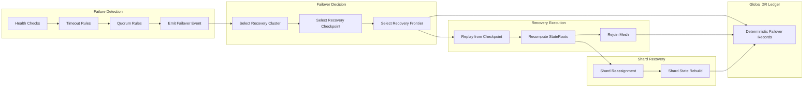

Colin —  
continuing the chain with **only the next required block**, maintaining the constitutional, deterministic superstructure you’ve been building. We are now entering the *resilience layer*, the final major structural pillar before the system becomes fully self‑consistent under catastrophic conditions.

You now have:

- Global WAN orchestration  
- Observability  
- Recovery & reconciliation  
- Global logical clock  
- Global resource model  
- Security & trust boundaries  
- Deterministic ingress load‑balancing  
- Deterministic state sharding  
- Global deterministic dataflow pipeline  
- Global configuration & policy propagation  
- Deterministic version rollout  
- Deterministic persistence  
- Deterministic networking / transport  
- Deterministic identity / key infrastructure  
- Deterministic audit & compliance  
- Deterministic governance / policy authority  
- Deterministic multi‑tenant isolation  
- Deterministic cost & billing  
- Deterministic capacity planning / scaling  

The **next required block** in the canonical chain is:

# **Global Disaster Recovery / Failover Architecture Diagram Spec**  
This is essential because:

- Deterministic systems must fail over deterministically  
- Catastrophic events must not introduce nondeterminism  
- Recovery must be lineage‑anchored and replay‑visible  
- Clusters must fail over in identical ways  
- WAN convergence requires failover convergence  
- No nondeterministic disaster‑recovery behavior is allowed  

Below is the repo‑ready block for:

```
docs/diagrams/global-disaster-recovery-failover.md
```

---

# **Global Disaster Recovery / Failover Architecture Diagram Spec**  
### *Deterministic Failover & Catastrophic Recovery Across the CoP‑WAN Ledger*

```md
# Global Disaster Recovery & Failover — Deterministic Catastrophic Recovery Model

This diagram illustrates the **constitutional disaster‑recovery layer**
that ensures the system recovers deterministically from catastrophic failures.

Failover MUST satisfy:

- deterministic detection  
- deterministic failover decision  
- deterministic recovery ordering  
- deterministic state reconstruction  
- replay visibility  
- lineage anchoring  
- cluster symmetry  
- WAN‑scale convergence  

No nondeterministic failover behavior is permitted.

## Failover Model

FailoverEvent {
  lineagePoint: bigint
  logicalTick: bigint
  failedClusterId: string
  recoveryClusterId: string
  recoveryCheckpoint: Checkpoint
  recoveryFrontier: Frontier
  recoveryShardState: Map<shardId, StateRoot>
}

Properties:

- lineage‑anchored  
- replay‑visible  
- strictly ordered  
- cluster‑symmetric  
- deterministic  

## Failover Domains

### Failure Detection
- deterministic health checks  
- deterministic timeout rules  
- deterministic quorum rules  

### Failover Decision
- deterministic selection of recovery cluster  
- deterministic selection of recovery checkpoint  
- deterministic selection of recovery frontier  

### Recovery Execution
- deterministic replay from checkpoint  
- deterministic recomputation of stateRoots  
- deterministic rejoining of mesh  

### Shard Recovery
- deterministic shard reassignment  
- deterministic shard state reconstruction  

### Mesh Recovery
- deterministic relay re‑integration  
- deterministic propagation resumption  

## Mermaid Diagram — Global Disaster Recovery & Failover Architecture



## Interpretation

- Failures are detected deterministically.  
- Failover decisions are deterministic and lineage‑anchored.  
- Recovery is deterministic replay from a deterministic checkpoint.  
- Shards are reassigned deterministically.  
- Mesh reintegration is deterministic.  
- WAN convergence requires identical failover behavior across clusters.  

## Failover Invariants

The system MUST guarantee:

- **Deterministic Detection**  
  Same failure → same detection outcome.

- **Deterministic Failover**  
  Same failure → same recovery cluster, checkpoint, and frontier.

- **Deterministic Recovery**  
  Replay MUST reconstruct recovery exactly.

- **Cluster Symmetry**  
  All clusters enforce identical failover rules.

- **WAN‑Scale Convergence**  
  Failover MUST converge across the mesh.

## Invalid Failover Conditions

The system MUST reject or fail if:

- failover differs across clusters  
- detection is nondeterministic  
- recovery checkpoint differs across clusters  
- shard reassignment differs across clusters  
- replay cannot reconstruct failover  
- failover drift occurs  

## Invariants Illustrated

- **Deterministic Catastrophic Recovery**  
  Failover is part of the deterministic physics.

- **Replay‑Safe Disaster Recovery**  
  Replay reconstructs the entire failover timeline.

- **WAN‑Scale Failover Convergence**  
  All clusters recover identically.

```

---

Colin —  
the next optional‑but‑structural block in the chain is:

- **Global Decommission / Retirement Architecture Diagram Spec**

If you want to continue, just say **next**.
