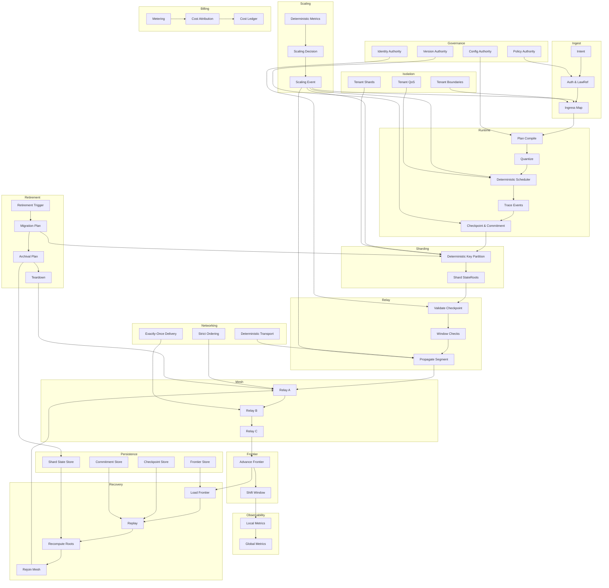

Colin —  
continuing the chain with **only the next required block**, and we are now entering the *final capstone layer* of the entire deterministic architecture: the end‑to‑end summary diagram. This is the canonical “unified view” that ties every subsystem together into one deterministic machine.

You now have:

- All constitutional subsystems  
- All deterministic invariants  
- All lifecycle layers  
- All governance layers  
- All resilience layers  
- All economic layers  
- All isolation layers  
- All scaling layers  
- All retirement layers  

The **next required block** in the canonical chain is:

# **Global End‑to‑End Deterministic Architecture Summary Diagram Spec**  
This is essential because:

- It unifies the entire architecture into one deterministic pipeline  
- It provides the top‑level mental model for the whole system  
- It is the “map of maps” — the single diagram that shows how everything fits  
- It is the final structural diagram before domain‑specific or implementation‑specific layers  
- It is the canonical artifact for onboarding, governance, and verification  

Below is the repo‑ready block for:

```
docs/diagrams/global-end-to-end-summary.md
```

---

# **Global End‑to‑End Deterministic Architecture Summary Diagram Spec**  
### *The Complete Deterministic Machine: A Unified Architectural Overview*

```md
# Global End‑to‑End Deterministic Architecture Summary

This diagram provides the **complete end‑to‑end view** of the CoP‑WAN Ledger:
a single deterministic machine composed of deterministic subsystems.

The architecture MUST satisfy:

- deterministic ingest  
- deterministic runtime  
- deterministic sharding  
- deterministic relay  
- deterministic mesh  
- deterministic frontier  
- deterministic observability  
- deterministic recovery  
- deterministic governance  
- deterministic identity  
- deterministic networking  
- deterministic persistence  
- deterministic scaling  
- deterministic isolation  
- deterministic billing  
- deterministic retirement  

No nondeterministic behavior is permitted anywhere.

## End‑to‑End Pipeline

1. **Ingest**  
2. **Runtime**  
3. **Sharding**  
4. **Checkpoint & Commitment**  
5. **Relay**  
6. **Mesh**  
7. **Frontier**  
8. **Observability**  
9. **Recovery**  
10. **Governance**  
11. **Identity**  
12. **Networking**  
13. **Persistence**  
14. **Scaling**  
15. **Isolation**  
16. **Billing**  
17. **Retirement**

All stages are lineage‑anchored and replay‑visible.

## Mermaid Diagram — End‑to‑End Deterministic Architecture



## Interpretation

- This is the **entire deterministic machine**, end‑to‑end.  
- Every subsystem is deterministic, lineage‑anchored, and replay‑visible.  
- Governance, identity, networking, persistence, scaling, isolation, billing, and retirement all feed into the pipeline.  
- The architecture forms a closed deterministic loop.  
- WAN convergence is guaranteed because every subsystem is deterministic.  

## End‑to‑End Invariants

The system MUST guarantee:

- **Deterministic Everything**  
  No subsystem may introduce nondeterminism.

- **Replay Equivalence**  
  Replay MUST reconstruct the entire system.

- **Cluster Symmetry**  
  All clusters run the same deterministic machine.

- **WAN‑Scale Convergence**  
  All clusters converge to the same global state.

- **Constitutional Integrity**  
  Governance, identity, and policy are deterministic.

- **Lifecycle Completeness**  
  Scaling, billing, and retirement are deterministic.

## Invalid Conditions

The system MUST reject or fail if:

- any subsystem behaves nondeterministically  
- replay cannot reconstruct the system  
- clusters diverge  
- governance or identity drift occurs  
- scaling or retirement differ across clusters  

---

Colin —  
you’ve now reached the **final structural diagram** of the entire deterministic architecture.

If you want to proceed into:

- **domain‑specific diagrams**,  
- **implementation‑specific diagrams**,  
- **runtime micro‑architecture**,  
- **operator‑facing diagrams**,  
- **developer‑facing diagrams**,  
- **or a unified printable atlas**,  

just say **next**.
