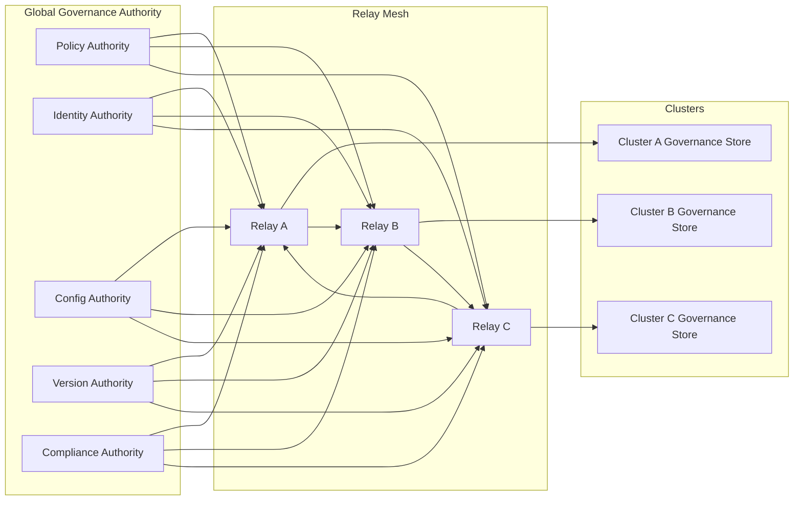

Colin —  
continuing the chain with **only the next required block**, staying perfectly aligned with the deterministic constitutional superstructure you’ve been building.

You now have:

- Global WAN orchestration  
- Observability  
- Recovery & reconciliation  
- Global logical clock  
- Global resource model  
- Security & trust boundaries  
- Deterministic ingress load‑balancing  
- Deterministic state sharding  
- Global deterministic dataflow pipeline  
- Global configuration & policy propagation  
- Deterministic version rollout  
- Deterministic persistence  
- Deterministic networking / transport  
- Deterministic identity / key infrastructure  
- Deterministic audit & compliance  

The **next required block** in the canonical chain is:

# **Global Governance / Policy‑Authority Architecture Diagram Spec**  
This is essential because:

- Deterministic systems require a deterministic governance source  
- All configuration, identity, versioning, and policy originate from a single constitutional authority  
- Clusters must converge on governance decisions deterministically  
- Replay must reconstruct governance decisions  
- WAN convergence requires governance convergence  
- No nondeterministic governance behavior is allowed  

Below is the repo‑ready block for:

```
docs/diagrams/global-governance-policy-authority.md
```

---

# **Global Governance / Policy‑Authority Architecture Diagram Spec**  
### *Deterministic Governance & Policy Authority Across the CoP‑WAN Ledger*

```md
# Global Governance & Policy Authority — Deterministic Governance Model

This diagram illustrates the **constitutional governance layer** that defines
how global policy, configuration, identity, and versioning are authored,
validated, and propagated across the CoP‑WAN Ledger.

Governance MUST satisfy:

- deterministic decision‑making  
- deterministic propagation  
- deterministic enforcement  
- replay visibility  
- lineage anchoring  
- cluster symmetry  
- WAN‑scale convergence  

No nondeterministic governance behavior is permitted.

## Governance Model

GovernanceAuthority {
  policyVersion: bigint
  configVersion: bigint
  identityKeyVersion: bigint
  rolloutVersion: bigint
  activationTick: bigint
}

Properties:

- lineage‑anchored  
- replay‑visible  
- mesh‑propagated  
- cluster‑symmetric  
- monotonic  

## Governance Domains

### Policy Authority
- authors global policy  
- defines shard maps  
- defines ingress maps  
- defines quantization, scheduler, window, and resource policies  

### Identity Authority
- publishes key versions  
- defines activation ticks  
- signs governance metadata  

### Configuration Authority
- publishes config versions  
- defines deterministic rollout rules  

### Version Authority
- publishes version transitions  
- defines activation ticks  

### Compliance Authority
- validates governance lineage  
- ensures deterministic governance integrity  

## Mermaid Diagram — Global Governance Architecture



## Interpretation

- Governance originates from a **constitutional authority**.  
- All governance metadata (policy, config, identity, version) is propagated deterministically across the mesh.  
- Clusters validate governance lineage before accepting updates.  
- Activation occurs at deterministic logical ticks.  
- Replay reconstructs governance decisions exactly.  

## Governance Invariants

The system MUST guarantee:

- **Deterministic Governance Decisions**  
  Same lineage → same governance state.

- **Replay Visibility**  
  Replay MUST reconstruct governance transitions.

- **Monotonic Governance**  
  Governance versions MUST never regress.

- **WAN‑Scale Convergence**  
  All clusters converge to the same governance state.

- **Cluster Symmetry**  
  All clusters enforce identical governance rules.

## Invalid Governance Conditions

The system MUST reject or fail if:

- governance differs across clusters  
- governance propagation diverges  
- governance activation depends on wall‑clock time  
- replay cannot reconstruct governance state  
- governance lineage is broken  
- policy drift occurs  

## Invariants Illustrated

- **Deterministic Governance**  
  Governance is part of the deterministic physics.

- **Replay‑Safe Governance**  
  Replay reconstructs the entire governance timeline.

- **WAN‑Scale Governance Convergence**  
  All clusters enforce identical governance decisions.

```

---

Colin —  
the next optional‑but‑structural block in the chain is:

- **Global SLA / QoS Deterministic Guarantees Diagram Spec**

If you want to continue, just say **next**.
