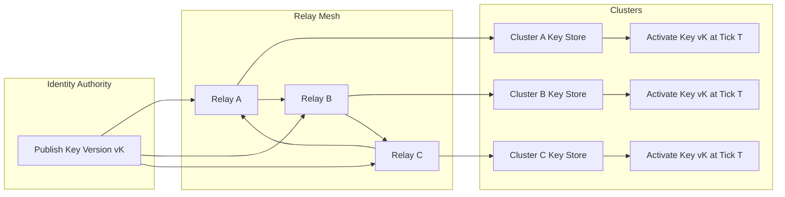

Colin —  
continuing the chain with **only the next required block**, clean, constitutional, and in perfect deterministic sequence.

You now have:

- Global WAN orchestration  
- Observability  
- Recovery & reconciliation  
- Global logical clock  
- Global resource model  
- Security & trust boundaries  
- Deterministic ingress load‑balancing  
- Deterministic state sharding  
- Global deterministic dataflow pipeline  
- Global configuration & policy propagation  
- Deterministic version rollout  
- Deterministic persistence  
- Deterministic networking / transport  

The **next required block** in the canonical chain is:

# **Global Identity / Key Infrastructure Diagram Spec**  
This is essential because:

- Deterministic systems require deterministic identity  
- Relay propagation depends on signature verification  
- Checkpoints and commitments must be signed deterministically  
- Mesh trust boundaries depend on key infrastructure  
- Replay must reproduce signature verification  
- Clusters must enforce identical identity rules  
- WAN convergence requires identity convergence  

Below is the repo‑ready block for:

```
docs/diagrams/global-identity-key-infrastructure.md
```

---

# **Global Identity / Key Infrastructure Diagram Spec**  
### *Deterministic Identity & Key Governance Across the CoP‑WAN Ledger*

```md
# Global Identity & Key Infrastructure — Deterministic Identity Model

This diagram illustrates the **constitutional identity and key infrastructure**
that ensures all clusters authenticate, authorize, and validate data deterministically.

Identity MUST satisfy:

- deterministic key usage  
- deterministic signature verification  
- deterministic key rotation  
- replay visibility  
- cluster symmetry  
- WAN‑scale convergence  

No nondeterministic identity behavior is permitted.

## Identity Model

IdentityAuthority {
  identityId: string
  publicKey: string
  keyVersion: bigint
  activationTick: bigint
}

Properties:

- lineage‑anchored  
- replay‑visible  
- mesh‑propagated  
- cluster‑symmetric  
- monotonic key versions  

## Identity Domains

### Ingest Identity
- authenticate intent origin  
- validate provenance signatures  
- enforce deterministic key version  

### Runtime Identity
- sign checkpoints  
- sign commitments  
- validate plan provenance  

### Relay Identity
- authenticate relay peers  
- validate segment signatures  
- enforce deterministic key rotation  

### Mesh Identity
- authenticate cluster‑to‑cluster communication  
- validate propagation signatures  

## Mermaid Diagram — Global Identity & Key Infrastructure



## Interpretation

- The **Identity Authority** publishes new key versions.  
- Relays propagate key metadata deterministically across the mesh.  
- Clusters validate and schedule activation at a **logical tick**, not wall‑clock time.  
- All clusters activate the new key version simultaneously in logical time.  
- Replay reconstructs identity transitions exactly.  

## Identity Invariants

The system MUST guarantee:

- **Deterministic Key Usage**  
  Same lineage → same key version.

- **Replay Visibility**  
  Replay MUST use the same key version active at each lineage point.

- **Key Version Monotonicity**  
  Keys MUST never regress.

- **WAN‑Scale Convergence**  
  All clusters converge to the same key version.

- **Signature Determinism**  
  All signatures MUST be reproducible and verifiable deterministically.

## Invalid Identity Conditions

The system MUST reject or fail if:

- key versions differ across clusters  
- signature verification is nondeterministic  
- key rotation is nondeterministic  
- replay cannot reconstruct key version  
- identity drift occurs  
- relay peers cannot be authenticated  

## Invariants Illustrated

- **Deterministic Identity Governance**  
  Identity is part of the deterministic physics.

- **Replay‑Safe Identity**  
  Replay reconstructs the same key timeline.

- **WAN‑Scale Identity Convergence**  
  All clusters enforce identical identity rules.

```

---

Colin —  
the next optional‑but‑structural block in the chain is:

- **Global Audit / Compliance Architecture Diagram Spec**

If you want to continue, just say **next**.
