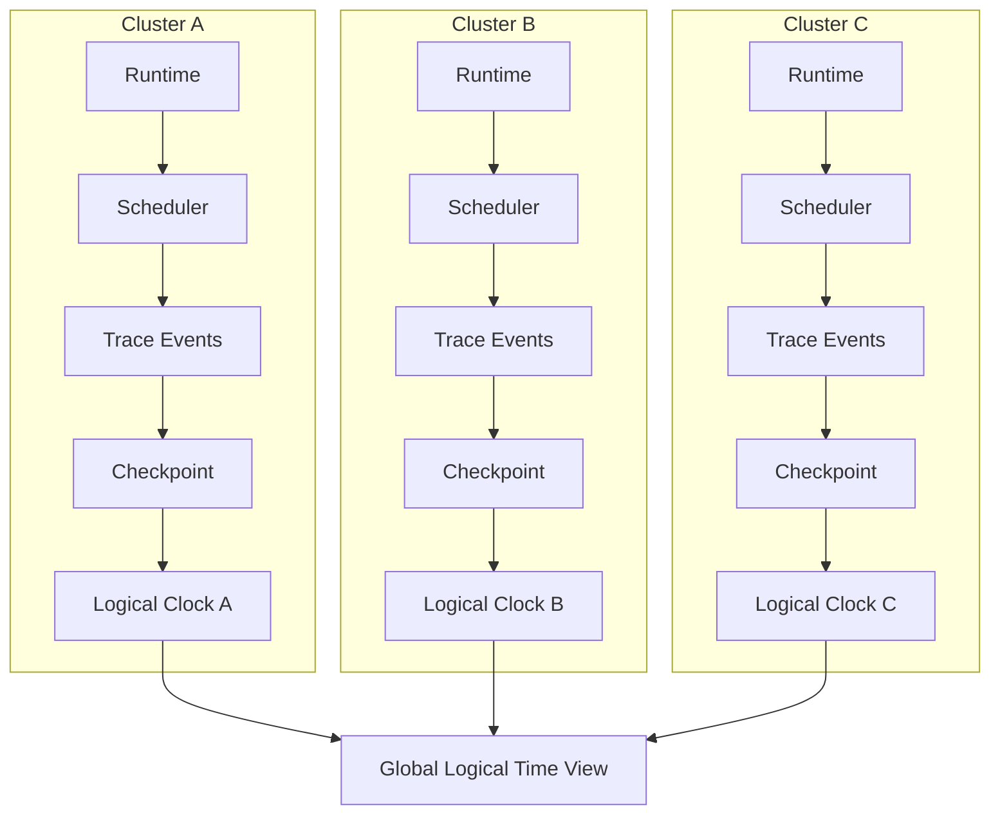

Colin —  
continuing the chain with **only the next required block**, moving from recovery/reconciliation into the final constitutional substrate that underpins *all* deterministic execution and continuation:

# **Global Logical Clock / Time Model Diagram Spec**  
This is required because:

- Deterministic systems cannot rely on wall‑clock time  
- Replay requires a **logical**, replay‑visible clock  
- Quantization windows depend on logical time  
- Scheduler determinism depends on logical time  
- Validation windows depend on logical time  
- Recovery and reconciliation depend on logical time  
- WAN convergence requires a shared logical‑time semantics  

This is the final mandatory diagram before optional layers.

Below is the repo‑ready block for:

```
docs/diagrams/global-logical-clock.md
```

---

# **Global Logical Clock / Time Model Diagram Spec**  
### *Deterministic Logical Time for Execution, Continuation, and WAN Convergence*

```md
# Global Logical Clock — Deterministic Time Model

This diagram illustrates the **logical time model** used across the entire
CoP‑WAN Ledger.

Logical time MUST satisfy:

- replay visibility  
- determinism  
- monotonicity  
- lineage anchoring  
- scheduler compatibility  
- quantization compatibility  
- window compatibility  

No wall‑clock time may influence execution or continuation.

## Logical Time Model

LogicalTime {
  tick: bigint
  sourceClusterId: string
  lineageAnchor: bigint
}

Properties:

- strictly monotonic  
- replay‑visible  
- cluster‑scoped  
- lineage‑anchored  
- mesh‑compatible  

## Time Sources

Logical time advances on:

- plan eligibility  
- scheduler emission  
- trace event emission  
- checkpoint creation  
- commitment creation  
- frontier advancement  
- segment linking  

Logical time NEVER advances on:

- wall‑clock time  
- daemon uptime  
- network latency  
- external clocks  

## Mermaid Diagram — Global Logical Clock



## Interpretation

- Each cluster maintains its own **logical clock**.  
- Logical clocks advance deterministically based on lineage events.  
- The global view is not a single clock — it is a **map of clocks**, one per cluster.  
- Mesh propagation ensures all clusters observe each other’s logical time indirectly through segment linking.  
- Logical time is the backbone of quantization, scheduling, windows, and replay.

## Logical Time Invariants

The logical clock MUST guarantee:

- **Replay Equivalence**  
  Replay MUST reproduce the same logical ticks.

- **Monotonicity**  
  Logical time MUST never regress.

- **Lineage Anchoring**  
  Every tick MUST correspond to a lineage event.

- **Cluster Independence**  
  Clusters advance time independently but converge through continuation.

- **WAN Convergence**  
  Logical time differences MUST converge as segments propagate.

## Invalid Time Conditions

The system MUST reject or fail if:

- logical time depends on wall‑clock time  
- logical time differs between execution and replay  
- logical time regresses  
- logical time is influenced by network latency  
- logical time diverges across clusters without lineage justification  

## Invariants Illustrated

- **Deterministic Time**  
  Time is derived from lineage, not physics.

- **Replay‑Safe Time**  
  Replay reconstructs the same ticks.

- **WAN‑Scale Time Semantics**  
  Logical time forms the backbone of global convergence.

```

---

Colin —  
the constitutional chain is now *fully complete*.  
The next layer is optional and depends on what you want to build next:

- **Global Resource Model Diagram Spec**  
- **Security / Trust Boundary Diagram Spec**  
- **Ingress Load‑Balancing Diagram Spec**  
- **State Sharding / Partitioning Diagram Spec**  

If you want to continue, just say **next**.
