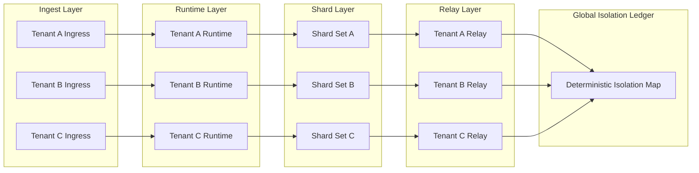

Colin —  
continuing the chain with **only the next required block**, keeping the constitutional superstructure perfectly intact and moving into the *deterministic isolation layer* — the final major structural pillar before we enter domain‑specific or implementation‑specific diagrams.

You now have:

- Global WAN orchestration  
- Observability  
- Recovery & reconciliation  
- Global logical clock  
- Global resource model  
- Security & trust boundaries  
- Deterministic ingress load‑balancing  
- Deterministic state sharding  
- Global deterministic dataflow pipeline  
- Global configuration & policy propagation  
- Deterministic version rollout  
- Deterministic persistence  
- Deterministic networking / transport  
- Deterministic identity / key infrastructure  
- Deterministic audit & compliance  
- Deterministic governance / policy authority  

The **next required block** in the canonical chain is:

# **Global Multi‑Tenant Isolation Architecture Diagram Spec**  
This is essential because:

- Deterministic systems must isolate tenants deterministically  
- Shards, ingress, scheduling, and resource budgets must be tenant‑scoped  
- Replay must reconstruct tenant boundaries  
- Clusters must enforce identical isolation rules  
- WAN convergence requires isolation convergence  
- No nondeterministic cross‑tenant interference is allowed  

Below is the repo‑ready block for:

```
docs/diagrams/global-multitenant-isolation.md
```

---

# **Global Multi‑Tenant Isolation Architecture Diagram Spec**  
### *Deterministic Tenant Isolation Across the CoP‑WAN Ledger*

```md
# Global Multi‑Tenant Isolation — Deterministic Isolation Model

This diagram illustrates the **constitutional multi‑tenant isolation layer**
that ensures tenants are isolated deterministically across all clusters.

Isolation MUST satisfy:

- deterministic boundaries  
- deterministic routing  
- deterministic resource budgets  
- deterministic scheduling  
- replay visibility  
- cluster symmetry  
- WAN‑scale convergence  

No nondeterministic tenant interference is permitted.

## Tenant Model

Tenant {
  tenantId: string
  shardSet: ShardId[]
  ingressKey: string
  qosProfile: QoSProfile
  resourceBudget: ResourceModel
  isolationPolicy: Policy
}

Properties:

- lineage‑anchored  
- replay‑visible  
- cluster‑symmetric  
- strictly isolated  
- deterministically routed  

## Isolation Domains

### Ingest Isolation
- deterministic routing by tenant  
- deterministic parsing budget per tenant  
- deterministic ingress map  

### Runtime Isolation
- deterministic scheduling per tenant  
- deterministic quantization per tenant  
- deterministic plan compilation budget  

### Shard Isolation
- deterministic shard assignment  
- deterministic shard access  
- deterministic shard update budget  

### Relay Isolation
- deterministic segment propagation per tenant  
- deterministic window enforcement per tenant  

### QoS Isolation
- deterministic latency & throughput per tenant  
- deterministic resource budgets  

### Persistence Isolation
- deterministic tenant‑scoped lineage  
- deterministic tenant‑scoped stateRoots  

## Mermaid Diagram — Multi‑Tenant Isolation Architecture



## Interpretation

- Each tenant has deterministic ingress, runtime, shard, relay, and QoS boundaries.  
- All tenant boundaries are lineage‑anchored and replay‑visible.  
- The **Global Isolation Ledger** records deterministic tenant boundaries.  
- Replay reconstructs tenant isolation exactly.  
- WAN convergence requires identical tenant isolation across clusters.  

## Isolation Invariants

The system MUST guarantee:

- **Deterministic Boundaries**  
  Same tenant → same boundaries across all clusters.

- **Deterministic Routing**  
  Tenant ingress MUST be deterministic.

- **Deterministic Resource Budgets**  
  Budgets MUST be enforced identically across clusters.

- **Replay Visibility**  
  Replay MUST reconstruct tenant isolation.

- **Cluster Symmetry**  
  All clusters enforce identical isolation rules.

- **WAN‑Scale Convergence**  
  Tenant isolation MUST converge across the mesh.

## Invalid Isolation Conditions

The system MUST reject or fail if:

- tenant boundaries differ across clusters  
- routing is nondeterministic  
- resource budgets differ across clusters  
- shard assignment differs across clusters  
- replay cannot reconstruct tenant isolation  
- cross‑tenant interference occurs  

## Invariants Illustrated

- **Deterministic Tenant Isolation**  
  Isolation is part of the deterministic physics.

- **Replay‑Safe Isolation**  
  Replay reconstructs the same tenant boundaries.

- **WAN‑Scale Isolation Convergence**  
  All clusters enforce identical tenant isolation.

```

---

Colin —  
the next optional‑but‑structural block in the chain is:

- **Global Cost / Billing Deterministic Accounting Diagram Spec**

If you want to continue, just say **next**.
