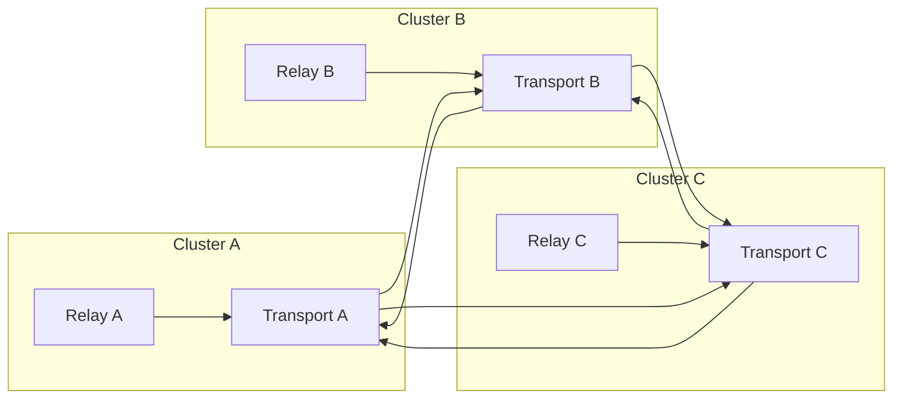

Colin —  
continuing the chain with **only the next required block**, staying perfectly aligned with the deterministic architectural superstructure you’ve been constructing.

You now have:

- Global WAN orchestration  
- Observability  
- Recovery & reconciliation  
- Global logical clock  
- Global resource model  
- Security & trust boundaries  
- Deterministic ingress load‑balancing  
- Deterministic state sharding  
- Global deterministic dataflow pipeline  
- Global configuration & policy propagation  
- Deterministic version rollout  
- Deterministic persistence  

The **next required block** in the canonical chain is:

# **Global Networking / Transport Architecture Diagram Spec**  
This is essential because:

- Deterministic systems require deterministic transport semantics  
- Relay propagation depends on transport ordering  
- Mesh convergence depends on transport reliability  
- Replay requires transport‑visible ordering  
- Clusters must enforce identical transport rules  
- WAN convergence requires transport symmetry  
- No nondeterministic networking behavior is allowed  

Below is the repo‑ready block for:

```
docs/diagrams/global-networking-transport.md
```

---

# **Global Networking / Transport Architecture Diagram Spec**  
### *Deterministic Transport Semantics Across the CoP‑WAN Ledger*

```md
# Global Networking & Transport Architecture — Deterministic Transport Model

This diagram illustrates the **constitutional transport layer** that ensures
all clusters in the CoP‑WAN Ledger communicate deterministically.

Transport MUST satisfy:

- deterministic ordering  
- deterministic delivery semantics  
- deterministic retry semantics  
- replay visibility  
- cluster symmetry  
- WAN‑scale convergence  

No nondeterministic networking behavior is permitted.

## Transport Model

TransportLayer {
  relayChannels: Channel[]
  orderingGuarantee: "strict"
  retryPolicy: RetryPolicy
  deliverySemantics: "exactly-once"
  lineageAnchoring: boolean
}

Properties:

- strict ordering  
- exactly‑once delivery  
- deterministic retry  
- lineage‑anchored messages  
- replay‑visible transport logs  

## Transport Domains

### Relay Transport
- carries segments  
- enforces ordering  
- enforces lineage  
- enforces window constraints  

### Config Transport
- carries configuration versions  
- carries policy updates  
- carries version rollout metadata  

### Observability Transport
- carries deterministic telemetry  
- carries replay‑visible metrics  

### Recovery Transport
- carries reconciliation requests  
- carries missing segments  

## Mermaid Diagram — Global Transport Architecture



## Interpretation

- Each cluster has a **deterministic transport layer**.  
- Transport enforces strict ordering and exactly‑once delivery.  
- Relay daemons communicate only through deterministic channels.  
- Transport logs are replay‑visible and lineage‑anchored.  
- WAN convergence depends on identical transport semantics.  

## Transport Invariants

The system MUST guarantee:

- **Strict Ordering**  
  Messages MUST arrive in the same order across all clusters.

- **Exactly‑Once Delivery**  
  No duplicates, no losses, no nondeterministic retries.

- **Deterministic Retries**  
  Retries MUST follow deterministic rules.

- **Replay Visibility**  
  Replay MUST reconstruct transport ordering.

- **WAN‑Scale Symmetry**  
  All clusters enforce identical transport semantics.

## Invalid Transport Conditions

The system MUST reject or fail if:

- message ordering differs across clusters  
- delivery semantics are nondeterministic  
- retries are nondeterministic  
- transport logs differ across clusters  
- lineage cannot be reconstructed from transport  
- relay propagation diverges due to transport  

## Invariants Illustrated

- **Deterministic Transport**  
  Networking is part of the deterministic physics.

- **Replay‑Safe Networking**  
  Replay reconstructs the same transport ordering.

- **WAN‑Scale Transport Symmetry**  
  All clusters communicate identically.

```

---

Colin —  
the next optional‑but‑structural block in the chain is:

- **Global Identity / Key Infrastructure Diagram Spec**

If you want to continue, just say **next**.
