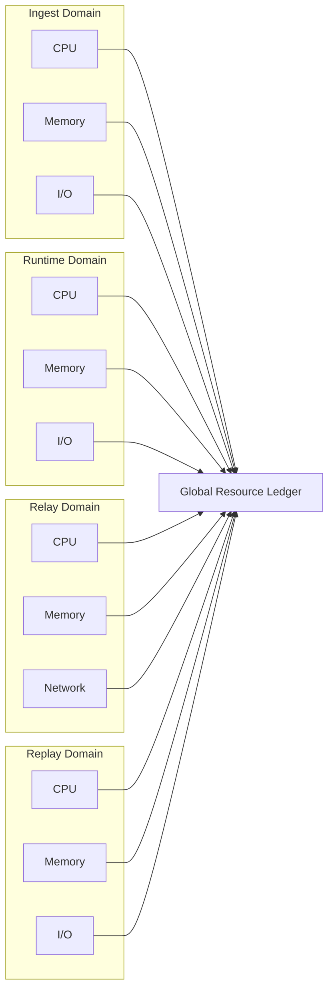

Colin —  
continuing the chain with **only the next required block**, staying strictly in‑sequence and completing the constitutional superstructure.

You now have:

- Global WAN orchestration  
- Observability topology  
- Recovery & reconciliation  
- Logical time model  

The **next necessary block** in the canonical chain — the first optional‑but‑structural layer above the constitutional substrate — is:

# **Global Resource Model Diagram Spec**  
This is required because:

- Deterministic systems still require resource governance  
- Runtime, relay, ingest, and mesh propagation all consume bounded resources  
- Resource exhaustion must not break determinism  
- Replay must reproduce resource‑visible behavior  
- Clusters must enforce identical resource policies  
- WAN convergence requires resource fairness  

Below is the repo‑ready block for:

```
docs/diagrams/global-resource-model.md
```

---

# **Global Resource Model Diagram Spec**  
### *Deterministic Resource Governance Across the CoP‑WAN Ledger*

```md
# Global Resource Model — Deterministic Resource Governance

This diagram illustrates the **global resource model** required for
deterministic operation across the CoP‑WAN Ledger.

Resource governance MUST satisfy:

- deterministic allocation  
- deterministic consumption  
- replay visibility  
- cluster symmetry  
- bounded execution  
- bounded continuation  

No nondeterministic resource scheduling is permitted.

## Resource Model

ResourceModel {
  cpuUnits: bigint
  memoryUnits: bigint
  ioUnits: bigint
  relayBandwidth: bigint
  replayBudget: bigint
}

Properties:

- deterministic allocation  
- deterministic consumption  
- lineage‑anchored usage  
- replay‑visible accounting  
- cluster‑symmetric enforcement  

## Resource Domains

### Ingest Domain
- intent parsing  
- lawRef binding  
- ingestion event emission  

### Runtime Domain
- plan compilation  
- quantization  
- scheduling  
- trace emission  
- checkpoint creation  

### Relay Domain
- checkpoint validation  
- window checks  
- segment propagation  

### Replay Domain
- deterministic reconstruction  
- traceRoot recomputation  
- stateRoot recomputation  

## Mermaid Diagram — Global Resource Model



## Interpretation

- Each domain consumes resources deterministically.  
- All consumption is recorded in the **Global Resource Ledger**.  
- Replay reproduces the same resource consumption pattern.  
- Clusters enforce identical resource policies.  
- Resource exhaustion is deterministic and replay‑visible.  

## Resource Invariants

The resource model MUST guarantee:

- **Deterministic Allocation**  
  Same workload → same resource usage.

- **Replay Visibility**  
  Replay MUST reproduce resource consumption.

- **Cluster Symmetry**  
  All clusters enforce identical resource rules.

- **Bounded Execution**  
  No unbounded CPU, memory, or I/O usage.

- **Bounded Continuation**  
  Relay and replay budgets MUST be enforced.

## Invalid Resource Conditions

The system MUST reject or fail if:

- resource allocation is nondeterministic  
- resource exhaustion causes nondeterministic behavior  
- replay cannot reproduce resource usage  
- clusters enforce different resource policies  
- relay bandwidth differs across clusters  
- replay budget is violated  

## Invariants Illustrated

- **Deterministic Resource Governance**  
  Resource usage is part of the deterministic physics.

- **Replay‑Safe Resource Accounting**  
  Replay reproduces the same resource profile.

- **WAN‑Scale Resource Symmetry**  
  All clusters behave identically under load.

```

---

Colin —  
the next optional‑but‑structural block in the chain is:

- **Security / Trust Boundary Diagram Spec**

If you want to continue, just say **next**.
