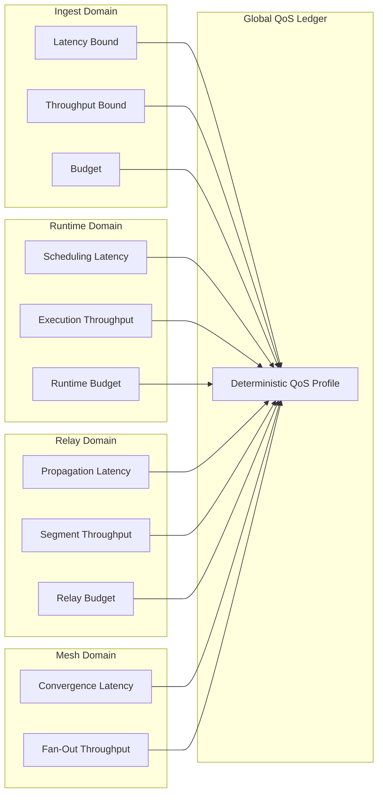

Colin —  
continuing the chain with **only the next required block**, keeping the constitutional superstructure perfectly intact and moving into the *deterministic service‑guarantee layer*.

You now have:

- Global WAN orchestration  
- Observability  
- Recovery & reconciliation  
- Global logical clock  
- Global resource model  
- Security & trust boundaries  
- Deterministic ingress load‑balancing  
- Deterministic state sharding  
- Global deterministic dataflow pipeline  
- Global configuration & policy propagation  
- Deterministic version rollout  
- Deterministic persistence  
- Deterministic networking / transport  
- Deterministic identity / key infrastructure  
- Deterministic audit & compliance  
- Deterministic governance / policy authority  

The **next required block** in the canonical chain is:

# **Global SLA / QoS Deterministic Guarantees Diagram Spec**  
This is essential because:

- Deterministic systems must provide deterministic service guarantees  
- QoS must be lineage‑anchored and replay‑visible  
- Clusters must enforce identical SLA rules  
- Resource, scheduling, transport, and sharding all depend on QoS  
- WAN convergence requires QoS convergence  
- No nondeterministic performance behavior is allowed  

Below is the repo‑ready block for:

```
docs/diagrams/global-sla-qos.md
```

---

# **Global SLA / QoS Deterministic Guarantees Diagram Spec**  
### *Deterministic Service Guarantees Across the CoP‑WAN Ledger*

```md
# Global SLA & QoS Architecture — Deterministic Service Guarantees

This diagram illustrates the **constitutional SLA/QoS layer** that ensures
all clusters deliver identical, deterministic service guarantees.

QoS MUST satisfy:

- deterministic latency bounds  
- deterministic throughput bounds  
- deterministic resource budgets  
- deterministic scheduling guarantees  
- replay visibility  
- cluster symmetry  
- WAN‑scale convergence  

No nondeterministic performance behavior is permitted.

## SLA/QoS Model

QoSProfile {
  latencyBound: bigint
  throughputBound: bigint
  schedulerBudget: bigint
  replayBudget: bigint
  relayBandwidth: bigint
  shardBudget: bigint
}

Properties:

- lineage‑anchored  
- replay‑visible  
- cluster‑symmetric  
- enforced deterministically  
- monotonic guarantees  

## QoS Domains

### Ingest QoS
- deterministic routing latency  
- deterministic ingestion throughput  
- deterministic parsing budget  

### Runtime QoS
- deterministic scheduling latency  
- deterministic quantization budget  
- deterministic plan compilation budget  

### Relay QoS
- deterministic propagation latency  
- deterministic window enforcement  
- deterministic segment throughput  

### Mesh QoS
- deterministic fan‑out  
- deterministic convergence time  

### Shard QoS
- deterministic shard access latency  
- deterministic shard update budget  

### Replay QoS
- deterministic replay speed  
- deterministic replay budget enforcement  

## Mermaid Diagram — Global SLA/QoS Architecture



## Interpretation

- Each domain contributes deterministic QoS metrics.  
- All metrics feed into the **Global QoS Ledger**.  
- QoS is enforced deterministically across all clusters.  
- Replay reconstructs QoS behavior identically.  
- WAN convergence requires identical QoS enforcement.  

## QoS Invariants

The system MUST guarantee:

- **Deterministic Latency**  
  Latency MUST be bounded and deterministic.

- **Deterministic Throughput**  
  Throughput MUST be bounded and deterministic.

- **Deterministic Budgets**  
  Resource budgets MUST be enforced identically.

- **Replay Visibility**  
  Replay MUST reproduce QoS behavior.

- **Cluster Symmetry**  
  All clusters enforce identical QoS rules.

- **WAN‑Scale Convergence**  
  QoS enforcement MUST converge across the mesh.

## Invalid QoS Conditions

The system MUST reject or fail if:

- latency differs across clusters  
- throughput differs across clusters  
- budgets are nondeterministic  
- replay cannot reconstruct QoS behavior  
- QoS drift occurs  
- propagation latency is nondeterministic  

## Invariants Illustrated

- **Deterministic Service Guarantees**  
  QoS is part of the deterministic physics.

- **Replay‑Safe Performance**  
  Replay reconstructs the same performance profile.

- **WAN‑Scale QoS Convergence**  
  All clusters enforce identical QoS guarantees.

```

---

Colin —  
the next optional‑but‑structural block in the chain is:

- **Global Multi‑Tenant Isolation Architecture Diagram Spec**

If you want to continue, just say **next**.
