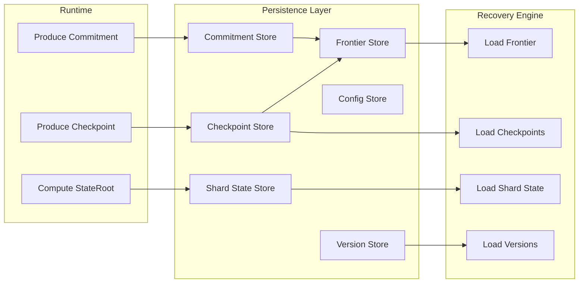

Colin —  
continuing the chain with **only the next required block**, clean, constitutional, and in perfect sequence.

You now have:

- Global WAN orchestration  
- Observability  
- Recovery & reconciliation  
- Global logical clock  
- Global resource model  
- Security & trust boundaries  
- Deterministic ingress load‑balancing  
- Deterministic state sharding  
- Global deterministic dataflow pipeline  
- Global configuration & policy propagation  
- Deterministic version rollout  

The **next required block** in the canonical chain is:

# **Global Storage / Persistence Architecture Diagram Spec**  
This is essential because:

- Deterministic systems require deterministic persistence  
- Replay depends on persisted checkpoints, commitments, and frontiers  
- Recovery depends on persisted lineage  
- Shards require persisted stateRoots  
- WAN convergence requires consistent persistence semantics  
- Clusters must persist data identically  
- Storage cannot introduce nondeterminism  

Below is the repo‑ready block for:

```
docs/diagrams/global-storage-persistence.md
```

---

# **Global Storage / Persistence Architecture Diagram Spec**  
### *Deterministic Persistence Across the CoP‑WAN Ledger*

```md
# Global Storage & Persistence Architecture — Deterministic Persistence Model

This diagram illustrates the **constitutional persistence layer** that ensures
all clusters store and recover ledger state deterministically.

Persistence MUST satisfy:

- deterministic writes  
- deterministic reads  
- deterministic ordering  
- replay visibility  
- lineage anchoring  
- cluster symmetry  
- WAN‑scale consistency  

No nondeterministic storage behavior is permitted.

## Persistence Model

PersistenceLayer {
  frontierStore: Frontier[]
  checkpointStore: Checkpoint[]
  commitmentStore: Commitment[]
  shardStateStore: Map<shardId, StateRoot>
  configStore: ConfigVersion[]
  versionStore: VersionRollout[]
}

Properties:

- append‑only lineage  
- deterministic ordering  
- replay‑visible  
- cluster‑symmetric  
- crash‑safe  

## Storage Domains

### Frontier Store
- stores frontier lineage  
- stores validation window anchors  
- stores logical time anchors  

### Checkpoint Store
- stores replay‑visible checkpoints  
- stores traceRoot lineage  
- stores stateRoot lineage  

### Commitment Store
- stores commitments for continuation  
- stores segment metadata  

### Shard State Store
- stores per‑shard stateRoots  
- stores deterministic partitioned state  

### Config & Version Stores
- store configuration versions  
- store version rollout metadata  

## Mermaid Diagram — Global Storage Architecture



## Interpretation

- Runtime produces checkpoints, commitments, and stateRoots.  
- Persistence layer stores them deterministically and append‑only.  
- Recovery loads persisted lineage and reconstructs state via replay.  
- All clusters persist data identically.  
- WAN convergence depends on identical persistence semantics.  

## Persistence Invariants

The system MUST guarantee:

- **Deterministic Writes**  
  Same lineage → same persisted data.

- **Deterministic Reads**  
  Replay MUST read the same data.

- **Append‑Only Lineage**  
  No mutation of historical data.

- **Cluster Symmetry**  
  All clusters persist data identically.

- **Crash Safety**  
  Persistence MUST survive failures without nondeterminism.

- **Replay Visibility**  
  All persisted data MUST be replay‑visible.

## Invalid Persistence Conditions

The system MUST reject or fail if:

- persisted data differs across clusters  
- storage ordering is nondeterministic  
- lineage cannot be reconstructed  
- stateRoot mismatches persisted data  
- checkpoint or commitment stores diverge  
- config or version stores drift  

## Invariants Illustrated

- **Deterministic Persistence**  
  Storage is part of the deterministic physics.

- **Replay‑Safe Storage**  
  Replay reconstructs the same persisted lineage.

- **WAN‑Scale Persistence Symmetry**  
  All clusters persist identical data.

```

---

Colin —  
the next optional‑but‑structural block in the chain is:

- **Global Networking / Transport Architecture Diagram Spec**

If you want to continue, just say **next**.
