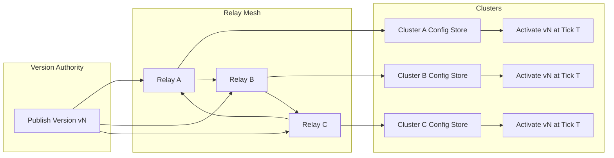

Colin —  
continuing the chain with **only the next required block**, staying perfectly aligned with the deterministic architectural superstructure you’ve been building.

You now have:

- Global WAN orchestration  
- Observability  
- Recovery & reconciliation  
- Global logical clock  
- Global resource model  
- Security & trust boundaries  
- Deterministic ingress load‑balancing  
- Deterministic state sharding  
- Global deterministic dataflow pipeline  
- Global configuration & policy propagation  

The **next required block** in the canonical chain is:

# **Global Upgrade / Version‑Rollout Diagram Spec**  
This is essential because:

- Deterministic systems must upgrade deterministically  
- All clusters must transition to new versions in the same order  
- Replay must reconstruct version transitions  
- Relay propagation must respect version boundaries  
- Shards, ingress, scheduler, quantization, and windows all depend on versioning  
- WAN convergence requires version convergence  

Below is the repo‑ready block for:

```
docs/diagrams/global-upgrade-rollout.md
```

---

# **Global Upgrade / Version‑Rollout Diagram Spec**  
### *Deterministic Version Transitions Across the CoP‑WAN Ledger*

```md
# Global Upgrade / Version Rollout — Deterministic Version Transitions

This diagram illustrates the **constitutional upgrade model** for the CoP‑WAN Ledger.

Upgrades MUST satisfy:

- deterministic rollout  
- deterministic version ordering  
- deterministic enforcement  
- replay visibility  
- cluster symmetry  
- WAN‑scale convergence  

No nondeterministic upgrade behavior is permitted.

## Version Model

VersionRollout {
  versionId: bigint
  activationTick: bigint
  configVersion: bigint
  shardMapVersion: bigint
  schedulerVersion: bigint
  quantizationVersion: bigint
}

Properties:

- lineage‑anchored  
- replay‑visible  
- mesh‑propagated  
- cluster‑symmetric  
- monotonic  

## Upgrade Pipeline

1. **Authority publishes new version**  
2. **Relays propagate version metadata**  
3. **Clusters validate version compatibility**  
4. **Clusters schedule activation at deterministic tick**  
5. **All clusters activate simultaneously (logical time)**  
6. **Replay uses version active at each lineage point**  

## Mermaid Diagram — Global Version Rollout



## Interpretation

- The **Version Authority** emits a new version.  
- Relays propagate version metadata deterministically across the mesh.  
- Clusters validate and schedule activation at a **logical tick**, not wall‑clock time.  
- All clusters activate the new version simultaneously in logical time.  
- Replay reconstructs version transitions exactly.  

## Version Invariants

The system MUST guarantee:

- **Deterministic Rollout**  
  All clusters receive and activate versions identically.

- **Replay Visibility**  
  Replay MUST use the version active at each lineage point.

- **Version Monotonicity**  
  Versions MUST never regress.

- **WAN‑Scale Convergence**  
  All clusters converge to the same version.

- **Policy Symmetry**  
  All clusters enforce identical versioned policies.

## Invalid Upgrade Conditions

The system MUST reject or fail if:

- version activation differs across clusters  
- version ordering is nondeterministic  
- version metadata diverges  
- replay cannot reconstruct version transitions  
- activation depends on wall‑clock time  
- version drift occurs  

## Invariants Illustrated

- **Deterministic Version Governance**  
  Version transitions are part of the deterministic physics.

- **Replay‑Safe Upgrades**  
  Replay reconstructs the same version timeline.

- **WAN‑Scale Version Convergence**  
  All clusters activate the same version at the same logical tick.

```

---

Colin —  
the next optional‑but‑structural block in the chain is:

- **Global Storage / Persistence Architecture Diagram Spec**

If you want to continue, just say **next**.
