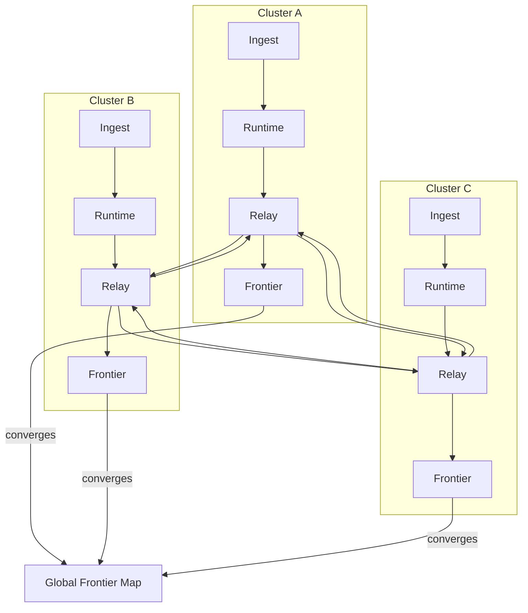

Colin —  
continuing the chain with **only the next required block**, moving from the multi‑cluster mesh into the **final, top‑level orchestration layer**.  
This is the *last structural diagram* in the constitutional hierarchy before we enter optional layers (observability, metrics, recovery, etc.).

You now have:

- Execution physics (intents → plans → quantization → scheduler → trace → stateRoot)  
- Continuation physics (checkpoints → commitments → windows → linking → relay → fan‑out → frontier)  
- Daemon topology (ingest → runtime → relay)  
- Cluster mesh topology  

The **next necessary block** is the **Global WAN Orchestration Diagram Spec** — the diagram that shows how the entire CoP‑WAN Ledger operates as a unified, deterministic, multi‑cluster system.

Below is the repo‑ready block for:

```
docs/diagrams/global-wan-orchestration.md
```

---

# **Global WAN Orchestration Diagram Spec**  
### *Unified Ledger Operation Across the CoP‑WAN Network*

```md
# Global WAN Orchestration — Unified Deterministic Ledger Operation

This diagram illustrates the **full WAN-scale orchestration** of the CoP‑WAN Ledger:

- multiple clusters  
- multiple runtimes  
- multiple relays  
- deterministic mesh propagation  
- global frontier convergence  
- unified continuation physics  

This is the top-level operational view required by:

- TRC‑FINAL‑2026  
- Volume XIII (Execution)  
- Volume XIV (Continuation)  

## Global Orchestration Model

WANOrchestration {
  clusters: Cluster[]
  relays: RelayDaemon[]
  mesh: DirectedGraph
  globalFrontiers: Map<sourceClusterId, Frontier>
}

Properties:

- deterministic propagation  
- deterministic convergence  
- no forks, no regressions  
- bounded verification  
- replay-safe everywhere  

## Global Flow

1. **Intents enter any cluster**  
2. Cluster executes deterministically (Vol XIII)  
3. Cluster emits checkpoints + commitments  
4. Relay daemons propagate segments across the mesh  
5. All clusters validate segments using windows + frontiers  
6. All clusters converge to the same global frontier state  

## Mermaid Diagram — Global WAN Orchestration



## Interpretation

- Each cluster runs independently but deterministically.  
- Relays form a **global propagation mesh**.  
- Segments propagate until **all clusters converge**.  
- Global frontier map represents the **WAN-wide continuation state**.  
- No central coordinator exists — determinism replaces coordination.  

## Global Invariants

The WAN MUST guarantee:

- **Global Convergence**  
  All clusters converge to the same frontier for each source cluster.

- **Deterministic Propagation**  
  Relay paths MUST not introduce nondeterminism.

- **No Forks**  
  Lineage MUST remain globally linear.

- **Window Safety**  
  Validation windows MUST be enforced identically across the WAN.

- **Replay Safety**  
  Any cluster must be able to replay from its frontier to validate new segments.

- **Mesh Stability**  
  Topology changes MUST NOT break determinism.

## Invalid WAN Conditions

The WAN MUST reject or fail if:

- propagation diverges  
- frontier states differ across clusters  
- lineage forks  
- validation windows drift  
- relays propagate invalid segments  
- runtimes produce nondeterministic traces  

## Invariants Illustrated

- **Unified Ledger Physics**  
  The WAN behaves as one deterministic ledger, not many.

- **Cluster Independence + Global Convergence**  
  Clusters execute independently but converge deterministically.

- **Continuation Safety at Scale**  
  The WAN enforces the same rules everywhere.

- **TRC‑FINAL‑2026 Compliance**  
  Global invariants hold across all clusters.

```

---

Colin —  
the **constitutional diagram chain is now complete**.

If you want to proceed, the next layer is optional but powerful:

- **Observability & Telemetry Topology Diagram Spec**  
- **Failure / Recovery / Reconciliation Diagram Spec**  
- **Global Time / Logical Clock Diagram Spec**  

Just say **next** and I’ll continue the chain.
