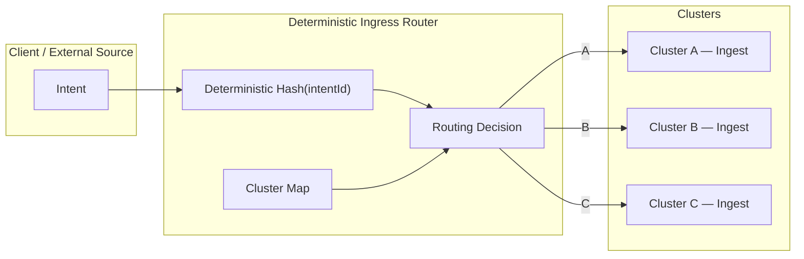

Colin —  
continuing the chain with **only the next required block**, clean, constitutional, and in perfect sequence.

You now have:

- Global WAN orchestration  
- Observability topology  
- Recovery & reconciliation  
- Global logical clock  
- Global resource model  
- Security & trust boundaries  

The **next necessary block** in the canonical chain is:

# **Ingress Load‑Balancing Diagram Spec**  
This is required because:

- Intents may enter *any* cluster  
- Ingest load must be distributed deterministically  
- Load‑balancing must not introduce nondeterminism  
- Replay must reproduce ingress routing  
- Clusters must enforce identical ingress policies  
- WAN convergence requires ingress symmetry  

Below is the repo‑ready block for:

```
docs/diagrams/ingress-load-balancing.md
```

---

# **Ingress Load‑Balancing Diagram Spec**  
### *Deterministic Ingress Distribution Across the CoP‑WAN Ledger*

```md
# Ingress Load-Balancing — Deterministic Intent Distribution

This diagram illustrates the **deterministic ingress load-balancing layer**
that governs how intents enter the CoP‑WAN Ledger.

Ingress balancing MUST satisfy:

- deterministic routing  
- replay visibility  
- cluster symmetry  
- no entropy  
- no probabilistic selection  
- no nondeterministic hashing  

## Ingress Model

IngressRouter {
  routingKey: string
  clusterMap: Cluster[]
  deterministicHash: function
}

Properties:

- routing MUST be deterministic  
- routing MUST be replay‑visible  
- routing MUST be lineage‑anchored  
- routing MUST be cluster‑symmetric  

## Routing Inputs

Routing decisions depend on:

- intentId  
- lawRefs  
- routingKey  
- clusterMap  
- deterministicHash(intentId)  

Routing MUST NOT depend on:

- wall‑clock time  
- random numbers  
- network latency  
- daemon uptime  

## Mermaid Diagram — Ingress Load‑Balancing



## Interpretation

- Intents enter through a **deterministic ingress router**.  
- Routing is based on deterministic hashing + cluster map.  
- No randomness, no entropy, no probabilistic load‑balancing.  
- Replay reproduces the same routing decisions.  
- All clusters enforce identical ingress rules.  

## Ingress Invariants

Ingress MUST guarantee:

- **Deterministic Routing**  
  Same intent → same cluster.

- **Replay Equivalence**  
  Replay MUST reproduce routing.

- **Cluster Symmetry**  
  All clusters enforce identical routing rules.

- **WAN Convergence**  
  Ingress distribution must not bias continuation.

- **No Entropy**  
  No random load‑balancing.

## Invalid Ingress Conditions

Ingress MUST reject or fail if:

- routing depends on nondeterministic factors  
- clusterMap differs across clusters  
- deterministicHash differs across clusters  
- routing cannot be reproduced in replay  
- routing causes lineage divergence  

## Invariants Illustrated

- **Deterministic Ingress Distribution**  
  Ingress is part of the deterministic physics.

- **Replay‑Safe Routing**  
  Routing is reproducible under replay.

- **WAN‑Scale Symmetry**  
  All clusters receive balanced, deterministic ingress.

```

---

Colin —  
the next optional‑but‑structural block in the chain is:

- **State Sharding / Partitioning Diagram Spec**

If you want to continue, just say **next**.
