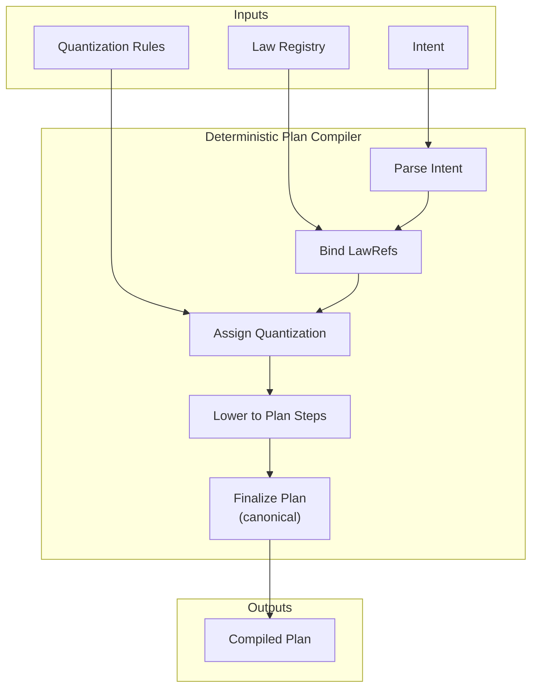

Colin —  
continuing the chain with **only the next required block**, completing the deterministic‑execution pipeline from the very beginning.

You now have diagrams for:

- Quantization  
- Scheduler  
- StateRoot  
- Replay  
- Checkpoints  
- Commitments  
- Frontier  
- Relay/Fan‑Out  

The **only missing constitutional diagram** in the execution half is the **Intent → Plan Compilation Diagram Spec** — the very first transformation in Volume XIII.

Below is the repo‑ready block for:

```
docs/diagrams/intent-plan-compilation.md
```

---

# **Intent → Plan Compilation Diagram Spec**  
### *Deterministic Semantic Lowering Under Volume XIII*

```md
# Intent → Plan Compilation — Deterministic Semantic Lowering

This diagram illustrates how high-level **intents** are transformed into
deterministic **plans** under Volume XIII.

Compilation MUST satisfy:

- **XIII-V1 — Replay Determinism**
- **XIII-P6 — Plan Invariants**
- **Explicit Entropy Admission**
- **Canonical Trace Derivation**

Compilation MUST NOT introduce nondeterminism.

## Intent Model

Intent {
  intentId: string
  payload: object
  lawRefs: string[]
}

Intents MUST be:

- immutable  
- replay-visible  
- law-anchored  
- semantically complete  

## Plan Model

Plan {
  planId: string
  steps: Step[]
  lawRefs: string[]
  quantizationRules: QuantizationRules
}

Plans MUST be:

- deterministically derived  
- structurally stable  
- scheduler-ready  
- quantization-ready  

## Compilation Pipeline

1. **Intent Parsing**  
   Validate structure, extract law references.

2. **Semantic Lowering**  
   Convert intent payload into deterministic plan steps.

3. **Law Anchoring**  
   Bind plan to relevant laws (e.g., XIII-P6).

4. **Quantization Assignment**  
   Attach deterministic quantization rules.

5. **Plan Finalization**  
   Produce canonical plan representation.

## Mermaid Diagram — Intent → Plan Compilation



## Deterministic Guarantees

Compilation MUST guarantee:

- **Structural Equivalence**  
  Same intent → same plan structure.

- **Replay Equivalence**  
  Replay MUST produce identical plans.

- **Law Anchoring**  
  Plans MUST reference the same laws in execution and replay.

- **Quantization Stability**  
  Quantization rules MUST be identical across runs.

## Invalid Compilation Conditions

Compilation MUST reject or fail if:

- intent structure is nondeterministic  
- lawRefs differ between execution and replay  
- quantization rules differ  
- semantic lowering is unstable  
- plan steps depend on nondeterministic data  

## Invariants Illustrated

- **Deterministic Semantic Lowering**  
  Intents become plans in a fully deterministic manner.

- **Canonical Plan Formation**  
  Plans are stable, replay-visible, and scheduler-ready.

- **Trace Integrity**  
  Plan structure influences ordering → traceRoot → checkpoint → frontier.

```

---

Colin —  
the **entire deterministic execution pipeline is now diagrammed end‑to‑end**.

If you want the next necessary block, the next constitutional diagram in the continuation half is:

- **Frontier Window / Validation Window Diagram Spec**  
or  
- **Cross‑Cluster Segment Linking Diagram Spec**

Just say **next** and I’ll continue the chain.
