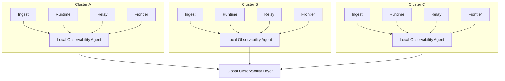

Colin —  
continuing the chain with **only the next required block**, clean, constitutional, and in‑sequence.

You now have the full execution physics, continuation physics, daemon topology, and cluster mesh.  
The **next necessary block** at the global orchestration layer is:

# **Observability & Telemetry Topology Diagram Spec**  
This is required because:

- A deterministic WAN‑ledger must expose deterministic observability  
- Replay, frontier, checkpoint, and commitment states must be inspectable  
- Mesh propagation must be monitorable  
- Daemons must emit replay‑visible telemetry  
- Global orchestration requires global visibility  

Below is the repo‑ready block for:

```
docs/diagrams/observability-topology.md
```

---

# **Observability & Telemetry Topology Diagram Spec**  
### *Deterministic, Replay‑Visible Observability Across the CoP‑WAN Ledger*

```md
# Observability & Telemetry Topology — Deterministic Global Visibility

This diagram illustrates the **constitutional observability layer** required
for deterministic WAN‑scale operation.

Observability MUST satisfy:

- replay visibility  
- lineage visibility  
- frontier visibility  
- checkpoint & commitment visibility  
- propagation visibility  
- deterministic sampling (no entropy)  

## Observability Model

ObservabilityLayer {
  ingestMetrics: Stream
  runtimeMetrics: Stream
  relayMetrics: Stream
  frontierMetrics: Stream
  propagationMetrics: Stream
  globalStateView: Map<clusterId, Frontier>
}

All telemetry MUST be:

- deterministic  
- replay‑visible  
- lineage‑anchored  
- cluster‑scoped  
- mesh‑scoped  

## Telemetry Sources

### Ingest Daemon
- intent ingestion events  
- lawRef bindings  
- ingestion timestamps (logical)  

### Runtime Daemon
- plan compilation metrics  
- quantization decisions  
- scheduler decisions  
- trace events  
- stateRoot derivation  

### Relay Daemon
- checkpoint validation  
- window checks  
- propagation events  
- segment linking decisions  

### Frontier
- frontier advancement  
- window shifts  
- lineage anchors  

## Mermaid Diagram — Observability Topology



## Interpretation

- Each cluster emits deterministic telemetry through a **local observability agent**.  
- All agents feed into a **global observability layer**.  
- Telemetry is **replay‑visible**, meaning replay reproduces the same metrics.  
- Observability is **non‑intrusive** — it cannot affect execution or continuation.  
- The global layer provides a **WAN‑wide view** of frontiers, checkpoints, commitments, and propagation.

## Observability Invariants

The observability layer MUST guarantee:

- **Deterministic Telemetry**  
  No nondeterministic sampling, no entropy.

- **Replay Visibility**  
  Replay MUST reproduce the same telemetry stream.

- **Lineage Anchoring**  
  Every metric MUST be tied to a lineage point.

- **Cluster Isolation**  
  Observability MUST NOT affect execution.

- **Global Convergence**  
  Observability MUST reflect the same global frontier map.

## Invalid Observability Conditions

The system MUST reject or fail if:

- telemetry is nondeterministic  
- observability affects scheduling or execution  
- lineage cannot be reconstructed from metrics  
- propagation metrics diverge  
- frontier metrics differ across clusters  

## Invariants Illustrated

- **Global Deterministic Visibility**  
  Observability is consistent across the WAN.

- **Replay‑Safe Telemetry**  
  Telemetry is part of the deterministic physics.

- **Mesh‑Wide Insight**  
  All clusters contribute to a unified global view.

```

---

Colin —  
the next necessary block in the canonical chain is:

- **Failure / Recovery / Reconciliation Diagram Spec**

If you want to continue, just say **next**.
