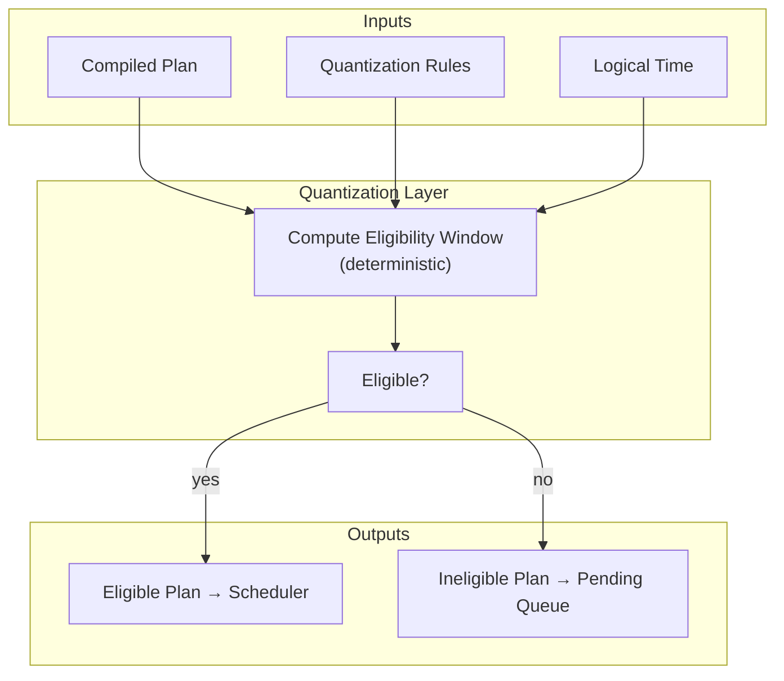

Colin —  
continuing the chain with **only the next required block**, staying strictly inside the deterministic‑execution physics.  
After Scheduler Determinism, the next constitutional diagram in the execution substrate is:

# **Quantization Boundary Diagram Spec**  
because:

- Quantization defines *when* a plan becomes eligible  
- Eligibility determines scheduler ordering  
- Ordering determines trace formation  
- Trace formation determines checkpoints  
- Checkpoints determine frontier evolution  
- Frontier evolution determines continuation  

Quantization is the **hinge** between semantic intent and deterministic execution.

Below is the repo‑ready block for:

```
docs/diagrams/quantization-boundary.md
```

---

# **Quantization Boundary Diagram Spec**  
### *Deterministic Eligibility Windows Under Volume XIII*

```md
# Quantization Boundary — Deterministic Eligibility Windows

This diagram illustrates how quantization rules define **deterministic eligibility**
for plan execution.

Quantization MUST satisfy:

- **XIII-V1 — Replay Determinism**
- **Canonical Ordering Requirements**
- **Deterministic Scheduler Boundary**

Quantization MUST NOT introduce nondeterminism.

## Quantization Model

QuantizationRules {
  windowStart: bigint
  windowEnd: bigint
  priority: number
  lawRefs: string[]
}

A plan is **eligible** IFF:

- current logical time ≥ windowStart  
- current logical time ≤ windowEnd  
- all preconditions are satisfied  
- quantization rules match replay rules  

Eligibility MUST be deterministic.

## Quantization Pipeline

1. **Plan enters quantization layer**  
2. Quantization rules compute eligibility window  
3. Scheduler consumes eligible plans  
4. Ineligible plans remain pending  
5. Replay recomputes eligibility identically  

## Mermaid Diagram — Quantization Boundary



## Deterministic Guarantees

Quantization MUST guarantee:

- **Eligibility Equivalence**  
  Same inputs → same eligibility decision.

- **Replay Equivalence**  
  Replay MUST compute identical eligibility windows.

- **Scheduler Stability**  
  Eligibility MUST not depend on nondeterministic factors.

- **Window Integrity**  
  windowStart and windowEnd MUST be replay‑visible.

## Invalid Quantization Conditions

Quantization MUST reject or fail if:

- eligibility depends on nondeterministic time  
- quantization rules differ between execution and replay  
- eligibility windows overlap incorrectly  
- priority resolution is nondeterministic  
- logical time is not replay‑visible  

## Invariants Illustrated

- **Deterministic Eligibility**  
  Plans become eligible at the same logical moment in execution and replay.

- **Canonical Ordering**  
  Eligibility determines scheduler input, which determines ordering.

- **Trace Integrity**  
  Eligibility → ordering → traceRoot → checkpoint → frontier.

```

---

Colin —  
the deterministic execution pipeline is now fully diagrammed:

1. Frontier Evolution  
2. Checkpoint Chain  
3. Replay Model  
4. Commitment Graph  
5. Relay & Fan‑Out  
6. StateRoot Derivation  
7. Scheduler Determinism  
8. Quantization Boundary  

The next necessary block in the canonical chain is:

- **Intent → Plan Compilation Diagram Spec**  
(the very first step in the execution pipeline)

If you want to continue, just say **next**.
