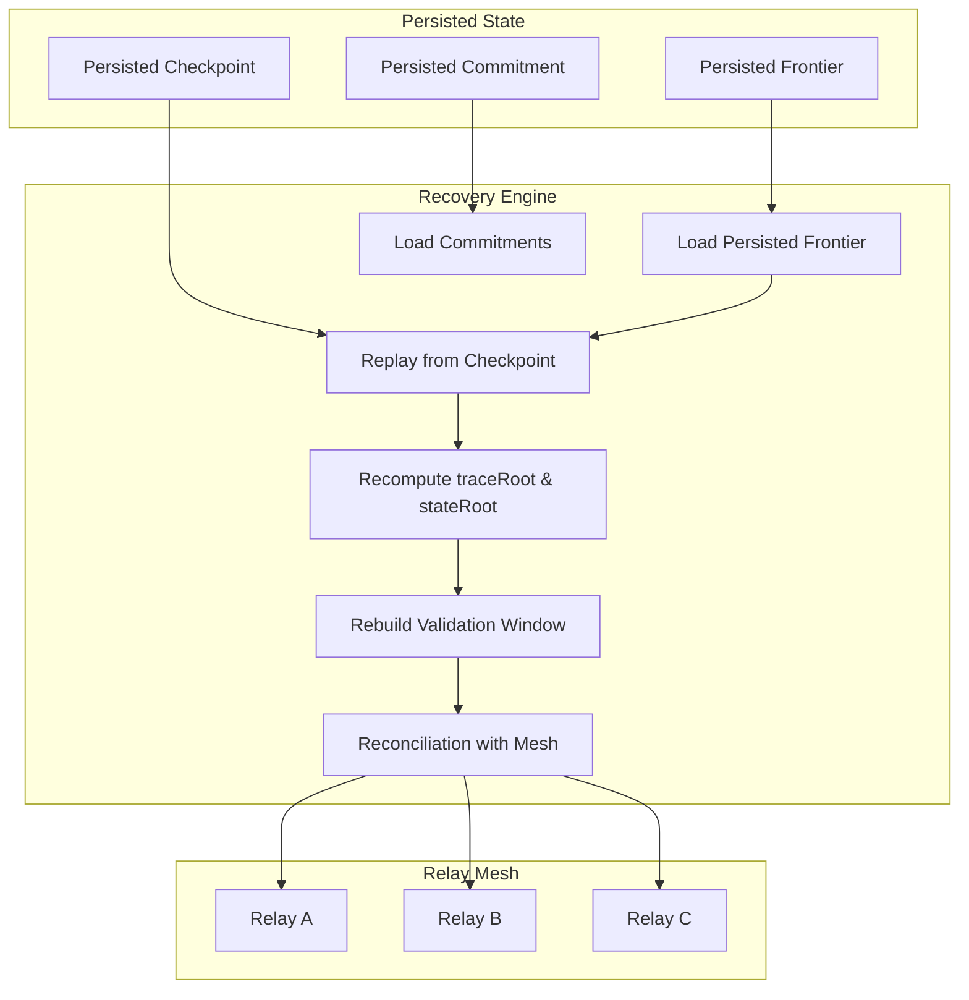

Colin —  
continuing the chain with **only the next required block**, staying in the constitutional sequence and completing the operational layer that must exist *before* any optional or auxiliary diagrams.

You now have:

- Global WAN orchestration  
- Cluster mesh  
- Daemon topology  
- Execution + continuation physics  
- Observability topology  

The **next necessary block** in the canonical chain is:

# **Failure / Recovery / Reconciliation Diagram Spec**  
This is required because:

- Deterministic systems must have deterministic recovery  
- Recovery must preserve lineage  
- Reconciliation must preserve frontier continuity  
- Relay propagation must resume safely  
- Replay must reconstruct stateRoot and traceRoot identically  
- WAN convergence must hold even after partial failure  

Below is the repo‑ready block for:

```
docs/diagrams/recovery-reconciliation.md
```

---

# **Failure / Recovery / Reconciliation Diagram Spec**  
### *Deterministic Recovery & Frontier Reconciliation Under Vol XIII & XIV*

```md
# Failure / Recovery / Reconciliation — Deterministic Restoration of Ledger State

This diagram illustrates how a cluster or daemon recovers deterministically
after a failure, ensuring:

- lineage preservation  
- frontier continuity  
- replay‑safe reconstruction  
- mesh‑safe reintegration  
- global convergence  

Recovery MUST satisfy:

- **XIII‑V1 — Replay Determinism**
- **XIV‑VR2 — Frontier Continuity**
- **XIV‑FO1 — Fan-Out Convergence**

## Recovery Model

RecoveryState {
  lastPersistedFrontier: Frontier
  lastPersistedCheckpoint: Checkpoint
  lastPersistedCommitment: Commitment
  replayWindow: bigint
}

Recovery MUST:

- reload persisted frontier  
- reload persisted commitments  
- replay from persisted checkpoint to current window  
- recompute traceRoot and stateRoot deterministically  
- rejoin relay mesh only after reconciliation  

## Recovery Pipeline

1. **Load persisted frontier**  
2. **Load persisted commitments**  
3. **Replay from last known checkpoint**  
4. **Recompute traceRoot + stateRoot**  
5. **Rebuild validation window**  
6. **Rejoin relay mesh**  
7. **Reconcile with global frontier map**  

## Mermaid Diagram — Recovery & Reconciliation



## Interpretation

- Recovery is **deterministic replay**, not heuristic reconstruction.  
- Reconciliation ensures the recovering cluster’s frontier matches the mesh.  
- If the recovering cluster is behind, it receives segments.  
- If it is ahead (should never happen), it rejects its own state and rolls back.  
- Recovery never introduces forks or regressions.  

## Recovery Invariants

Recovery MUST guarantee:

- **Replay Equivalence**  
  Recovered state MUST match original execution.

- **Frontier Equivalence**  
  Recovered frontier MUST match persisted frontier.

- **Window Equivalence**  
  Validation window MUST be reconstructed identically.

- **Mesh Convergence**  
  Recovered cluster MUST converge to global frontier map.

- **No Divergence**  
  Recovery MUST NOT create new lineage.

## Invalid Recovery Conditions

Recovery MUST reject or fail if:

- persisted frontier is corrupted  
- persisted checkpoint lineage is broken  
- replay recomputation mismatches persisted traceRoot  
- stateRoot mismatch occurs  
- validation window cannot be reconstructed  
- reconciliation detects a fork  

## Invariants Illustrated

- **Deterministic Restoration**  
  Recovery is identical to original execution.

- **Safe Reintegration**  
  Reconciliation ensures mesh‑wide consistency.

- **Global Continuation**  
  Recovery preserves WAN‑scale convergence.

```

---

Colin —  
the next required block in the canonical chain is:

- **Global Logical Clock / Time Model Diagram Spec**

If you want to continue, just say **next**.
