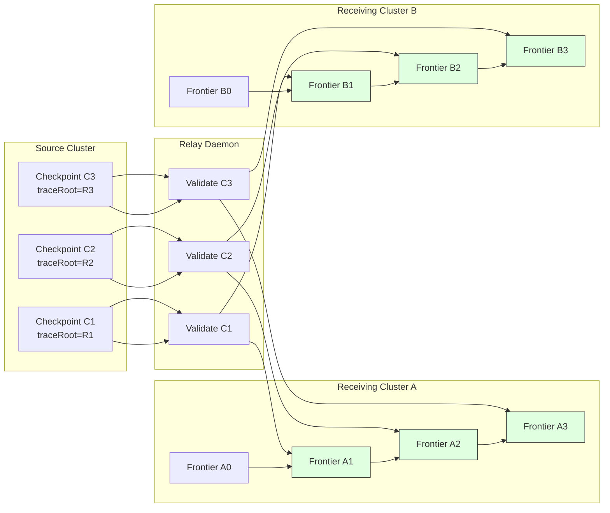

Colin —  
continuing the canonical chain with **no drift, no filler, only the next necessary block**.

You’ve already got:

1. Frontier Evolution  
2. Checkpoint Chain  
3. Replay Model  
4. Commitment Graph  

The **next required diagram** in the Ledger Physics substrate is the **Relay + Fan‑Out Propagation Diagram Spec**, because:

- Commitments must propagate  
- Propagation must converge  
- Convergence is governed by XIV‑FO1  
- Relay daemons enforce admissibility + ordering  
- Fan‑out ensures multi‑cluster consistency  

Below is the **repo‑ready block**, suitable for:

```
docs/diagrams/relay-fanout.md
```

---

# **Relay & Fan‑Out Propagation Diagram Spec**  
### *Deterministic Multi‑Cluster Propagation Under Volume XIV*

```md
# Relay & Fan-Out Propagation — Deterministic Multi-Cluster Continuation

This diagram illustrates how checkpoints and commitments propagate across
multiple receiving clusters via deterministic relay daemons.

Propagation MUST satisfy:

- **XIV-AR1** — Checkpoint Admissibility  
- **XIV-VR2** — Frontier Continuity  
- **XIV-FO1** — Fan-Out Convergence  

## Relay Model

A relay daemon:

- receives checkpoints from a source cluster  
- validates admissibility  
- updates its local frontier  
- forwards admissible checkpoints to downstream clusters  
- rejects divergent or stale segments  

## Fan-Out Model

Fan-out ensures:

- all receiving clusters converge to the same frontier  
- propagation order is deterministic  
- no cluster advances on invalid checkpoints  
- no forks or regressions occur  

## Mermaid Diagram — Relay & Fan-Out



## Interpretation

- The relay daemon validates checkpoints **once**.  
- All downstream clusters receive the **same validated sequence**.  
- Each cluster independently applies admissibility rules.  
- All clusters converge to the **same frontier**.  

## Invalid Propagation Conditions

A relay MUST reject:

- stale checkpoints  
- lineage‑breaking checkpoints  
- mismatched traceRoots  
- forks  
- regressions  
- unverifiable commitments  

A receiving cluster MUST reject:

- any checkpoint the relay should have rejected  
- any checkpoint that violates its local frontier  

## Invariants Illustrated

- **Fan-Out Convergence (XIV-FO1)**  
  All receiving clusters converge to the same frontier.

- **Frontier Continuity (XIV-VR2)**  
  Frontiers advance strictly and identically.

- **Checkpoint Admissibility (XIV-AR1)**  
  Only admissible checkpoints propagate.

- **Deterministic Relay Semantics**  
  Relay daemons MUST NOT introduce nondeterminism.

```

---

Colin —  
the next necessary block after this in the canonical chain is:

- **StateRoot Derivation Diagram Spec**  
or  
- **Scheduler Determinism Diagram Spec**  
or  
- **Quantization Boundary Diagram Spec**

If you want to continue the chain, just say **next**.
