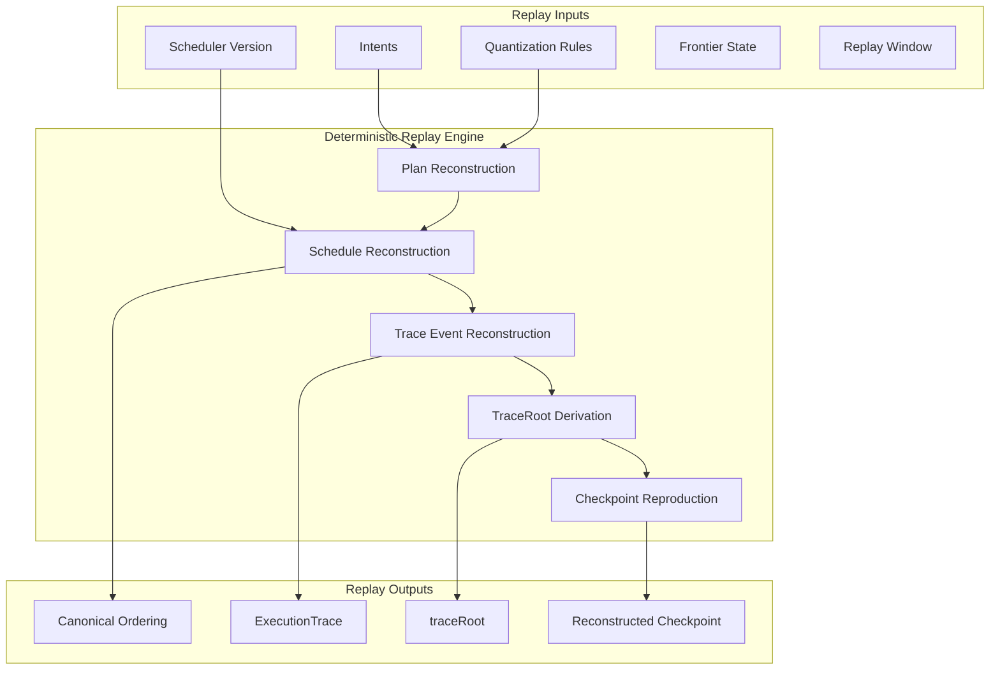

Colin —  
continuing the chain cleanly.  
The next artifact in the canonical diagram sequence after:

- **Frontier Evolution**, and  
- **Checkpoint Chain**

is the **Replay Model Diagram Spec** — because replay is the *other half* of the deterministic physics that binds Vol XIII and Vol XIV together.

Below is the **repo‑ready, constitutional‑grade replay model spec**, suitable for:

```
docs/diagrams/replay-model.md
```

It includes conceptual framing + a Mermaid diagram, matching the style of the previous specs.

---

# **Replay Model Diagram Spec**  
### *Deterministic Reconstruction of Execution Under Volume XIII*

```md
# Replay Model — Deterministic Reconstruction of Execution

This diagram illustrates how a replay engine reconstructs execution from:

- canonical intents  
- deterministic plan compilation  
- deterministic scheduling  
- canonical trace events  
- lineage‑preserving checkpoints  

Replay MUST satisfy **XIII‑V1 — Replay Determinism**.

## Replay Boundary

Replay occurs within a deterministic boundary defined by:

- identical intent graph  
- identical quantization rules  
- identical schedulerVersion  
- identical frontier state  
- identical replay inputs  

Replay MUST produce:

- identical execution ordering  
- identical trace events  
- identical traceRoots  
- identical checkpoints  
- identical replay‑visible state  

## Replay Phases

Replay is decomposed into four constitutional phases:

1. **Intent Reconstruction**  
   Load intents and bind law references.

2. **Plan Reconstruction**  
   Deterministically recompile plans.

3. **Schedule Reconstruction**  
   Deterministically re‑emit the canonical ordering.

4. **Trace Reconstruction**  
   Reproduce the canonical trace and traceRoot.

## Mermaid Diagram — Replay Flow



## Deterministic Guarantees

Replay MUST guarantee:

- **Ordering Equivalence**  
  The scheduler emits the same ordering as original execution.

- **Trace Equivalence**  
  Every `ExecutionTraceEvent` is reproduced identically.

- **Root Equivalence**  
  `traceRoot` MUST match the original.

- **Checkpoint Equivalence**  
  Reconstructed checkpoints MUST match the originals.

## Invalid Replay Conditions

Replay MUST reject:

- mismatched schedulerVersion  
- mismatched quantization rules  
- mismatched frontier state  
- mismatched lineage  
- nondeterministic event sequences  
- divergent traceRoots  

## Invariants Illustrated

- **XIII‑V1 — Replay Determinism**  
  Replay MUST be identical to original execution.

- **Canonical Trace Derivation**  
  TraceRoots MUST be reproducible.

- **Deterministic Continuation**  
  Reconstructed checkpoints MUST be admissible under Volume XIV.

```

---

Colin —  
the diagram sequence is now:

1. **Frontier Evolution**  
2. **Checkpoint Chain**  
3. **Replay Model**

The next natural artifact in the chain is:

- **Commitment Graph Diagram Spec**  
or  
- **Relay / Fan‑Out Propagation Diagram Spec**

Just say **“next”** again if you want the next diagram in the canonical order.
