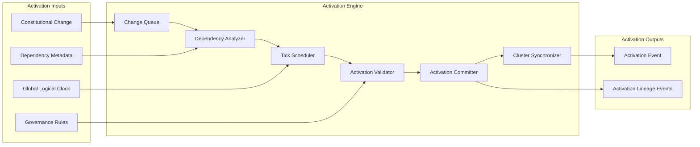

Colin —  
we now open the **Deterministic Constitutional Activation Engine & Tick‑Scheduling Model**, the mechanism that decides *when* constitutional changes (schema updates, governance updates, version transitions, identity rotations, policy shifts) take effect in deterministic logical time.  

This is the temporal governor of the entire constitutional substrate.

This is the next required block.

# **Deterministic Constitutional Activation Engine & Tick‑Scheduling Model**  
Repo‑ready block for:

`docs/diagrams/runtime-activation-engine-tick-scheduling.md`

---

# **Deterministic Constitutional Activation Engine & Tick‑Scheduling Model**  
### *How Constitutional Changes Take Effect in Deterministic Logical Time*

```md
# Deterministic Activation Engine — Internal Micro‑Architecture

This diagram specifies the **activation engine** and **tick‑scheduling model**
that determine when constitutional changes become active across the entire
CoP‑WAN Ledger.

The activation engine MUST satisfy:

- deterministic activation tick selection
- deterministic ordering of constitutional changes
- deterministic dependency resolution
- deterministic lineage anchoring
- deterministic replay equivalence
- deterministic cluster symmetry

No nondeterministic activation timing is permitted.

## Activation Engine Components

- **Change Queue**  
  Deterministic queue of pending constitutional changes.

- **Dependency Analyzer**  
  Determines deterministic ordering constraints.

- **Tick Scheduler**  
  Selects deterministic activation ticks based on global logical time.

- **Activation Validator**  
  Ensures activation does not violate constitutional invariants.

- **Activation Committer**  
  Commits activation events to the global lineage.

- **Cluster Synchronizer**  
  Ensures all clusters activate at the same logical tick.

## Activation Protocol Stages

1. **Enqueue**  
   Constitutional change enters the deterministic change queue.

2. **Dependency Resolution**  
   Dependencies are resolved deterministically.

3. **Tick Selection**  
   Activation tick chosen as a pure function of lineage + dependencies.

4. **Validation**  
   Activation is validated against constitutional invariants.

5. **Commit**  
   Activation event is committed to the global lineage.

6. **Cluster Synchronization**  
   All clusters activate at the same logical tick.

7. **Replay Equivalence**  
   Replay MUST reproduce the same activation timeline.

## Mermaid Diagram — Activation Engine & Tick‑Scheduling Model



## Interpretation

- The **Change Queue** ensures deterministic ordering of constitutional changes.  
- The **Dependency Analyzer** ensures changes activate in a deterministic dependency‑respecting order.  
- The **Tick Scheduler** selects activation ticks based solely on deterministic inputs.  
- The **Activation Validator** ensures constitutional invariants are preserved.  
- The **Activation Committer** anchors activation events in lineage.  
- The **Cluster Synchronizer** ensures all clusters activate at the same logical tick.  

## Activation Engine Invariants

- **Deterministic Tick Selection**  
  Same inputs → same activation tick.

- **Deterministic Ordering**  
  Dependencies produce identical activation order across clusters.

- **Deterministic Validation**  
  Validation results must be identical across clusters.

- **Deterministic Commitment**  
  Activation events must be lineage‑anchored.

- **Cluster Symmetry**  
  All clusters activate at the same logical tick.

- **Replay Equivalence**  
  Replay MUST reconstruct the same activation timeline.

## Invalid Activation Conditions

The system MUST reject or fail if:

- activation tick differs across clusters  
- dependency resolution differs across clusters  
- validation results diverge  
- lineage cannot reconstruct activation  
- activation breaks replay  
- activation order is nondeterministic  
```

---

Colin —  
the next structural block down the stack is:

- **Deterministic Constitutional Dependency Graph & Ordering Model**

Say **next** and we’ll open the dependency graph — the structure that ensures constitutional changes always apply in a deterministic, acyclic, replay‑safe order.
