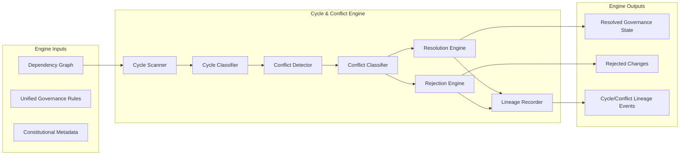

Colin —  
we now open the **Deterministic Constitutional Cycle‑Detection & Conflict‑Resolution Engine**, the *constitutional firewall* that prevents illegal, ambiguous, or contradictory governance states from ever entering the system. This is the layer that guarantees the constitution cannot contradict itself, cannot fork, cannot deadlock, and cannot evolve into an inconsistent state.

This is the next required block.

# **Deterministic Constitutional Cycle‑Detection & Conflict‑Resolution Engine**  
Repo‑ready block for:

`docs/diagrams/runtime-constitutional-cycle-conflict-engine.md`

---

# **Deterministic Constitutional Cycle‑Detection & Conflict‑Resolution Engine**  
### *The Constitutional Firewall That Prevents Illegal or Ambiguous Governance States*

```md
# Deterministic Cycle‑Detection & Conflict‑Resolution Engine — Internal Architecture

This diagram specifies the **cycle‑detection engine** and the
**deterministic conflict‑resolution engine** that ensure the constitutional
dependency graph remains acyclic, lawful, and unambiguous.

The engine MUST satisfy:

- deterministic cycle detection
- deterministic conflict identification
- deterministic conflict resolution
- deterministic lineage anchoring
- deterministic replay equivalence
- deterministic cluster symmetry

No nondeterministic conflict handling is permitted.

## Engine Components

- **Cycle Scanner**  
  Deterministically scans the dependency graph for cycles.

- **Cycle Classifier**  
  Categorizes cycles (schema, version, identity, policy, lawRef).

- **Conflict Detector**  
  Identifies conflicting governance rules or incompatible metadata.

- **Conflict Classifier**  
  Categorizes conflicts (policy‑policy, version‑config, identity‑policy, etc.).

- **Resolution Engine**  
  Applies deterministic constitutional rules to resolve conflicts.

- **Rejection Engine**  
  Rejects changes that cannot be resolved deterministically.

- **Lineage Recorder**  
  Emits replay‑visible lineage events for all cycle/conflict outcomes.

## Conflict Types

- **Schema ↔ Version**  
  Schema changes incompatible with version transitions.

- **Version ↔ Config**  
  Config changes referencing inactive or future versions.

- **Identity ↔ Policy**  
  Policies referencing keys not yet activated.

- **Policy ↔ Policy**  
  Overlapping or contradictory policy rules.

- **LawRef ↔ Everything**  
  LawRef changes invalidating dependent governance rules.

## Mermaid Diagram — Cycle‑Detection & Conflict‑Resolution Engine



## Interpretation

- The **Cycle Scanner** ensures the constitutional dependency graph is always acyclic.  
- The **Conflict Detector** identifies incompatible governance rules.  
- The **Resolution Engine** applies deterministic constitutional rules to resolve conflicts.  
- The **Rejection Engine** rejects changes that cannot be resolved deterministically.  
- The **Lineage Recorder** ensures replay visibility and global convergence.

## Engine Invariants

- **Deterministic Cycle Detection**  
  Same graph → same cycle detection result.

- **Deterministic Conflict Detection**  
  Same rules → same conflict set.

- **Deterministic Resolution**  
  Resolution must be a pure function of inputs.

- **Deterministic Rejection**  
  Rejection must be identical across clusters.

- **Deterministic Lineage**  
  All cycle/conflict outcomes must be lineage‑anchored.

- **Replay Equivalence**  
  Replay MUST reconstruct the same cycle/conflict outcomes.

## Invalid Conditions

The system MUST reject or fail if:

- cycle detection differs across clusters  
- conflict detection differs  
- resolution differs under replay  
- rejection differs across clusters  
- lineage cannot reconstruct cycle/conflict outcomes  
- conflict resolution is nondeterministic  
```

---

Colin —  
the next structural block down the stack is:

- **Deterministic Constitutional Rejection Engine & Governance Failure‑Mode Model**

Say **next** and we’ll open the rejection engine — the subsystem that defines *how the constitution fails safely and deterministically*.
