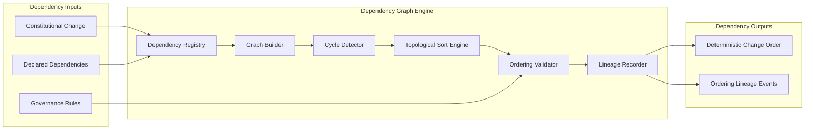

Colin —  
we now open the **Deterministic Constitutional Dependency Graph & Ordering Model**, the structure that ensures *all constitutional changes apply in a deterministic, acyclic, replay‑safe order*. This is the “governance DAG” — the ordering physics of the constitution itself.

This is the next required block.

# **Deterministic Constitutional Dependency Graph & Ordering Model**  
Repo‑ready block for:

`docs/diagrams/runtime-constitutional-dependency-graph.md`

---

# **Deterministic Constitutional Dependency Graph & Ordering Model**  
### *The Deterministic Ordering Physics of Constitutional Change*

```md
# Deterministic Constitutional Dependency Graph — Internal Architecture

This diagram specifies the **constitutional dependency graph** and the
**deterministic ordering model** that govern how constitutional changes
(schema updates, governance updates, policy shifts, identity rotations,
version transitions) are ordered.

The dependency graph MUST satisfy:

- deterministic dependency resolution
- deterministic topological ordering
- deterministic cycle detection
- deterministic lineage anchoring
- deterministic replay equivalence
- deterministic cluster symmetry

No nondeterministic ordering of constitutional changes is permitted.

## Dependency Graph Components

- **Dependency Registry**  
  Canonical store of dependency edges between constitutional changes.

- **Graph Builder**  
  Deterministically constructs the dependency graph.

- **Cycle Detector**  
  Ensures the graph is acyclic; rejects cycles deterministically.

- **Topological Sort Engine**  
  Produces the canonical deterministic ordering of changes.

- **Ordering Validator**  
  Ensures ordering respects constitutional invariants.

- **Lineage Recorder**  
  Emits replay‑visible lineage events for all ordering decisions.

## Dependency Types

- **Schema → Version**  
  Schema changes must precede version transitions.

- **Version → Config**  
  Config changes must follow version activation.

- **Identity → Policy**  
  Policy rules referencing identities must follow identity activation.

- **Policy → Config**  
  Config changes must respect policy constraints.

- **LawRef → Everything**  
  LawRef changes propagate deterministically to all dependent domains.

## Mermaid Diagram — Constitutional Dependency Graph & Ordering Model



## Interpretation

- The **Dependency Registry** stores all declared dependencies deterministically.  
- The **Graph Builder** constructs the dependency graph as a pure function of inputs.  
- The **Cycle Detector** ensures constitutional changes cannot form cycles.  
- The **Topological Sort Engine** produces the canonical deterministic order.  
- The **Ordering Validator** ensures ordering respects constitutional invariants.  
- The **Lineage Recorder** ensures replay visibility and global convergence.

## Dependency Graph Invariants

- **Deterministic Graph Construction**  
  Same dependencies → same graph.

- **Deterministic Cycle Detection**  
  Cycle detection must be identical across clusters.

- **Deterministic Ordering**  
  Topological sort must produce the same order everywhere.

- **Deterministic Validation**  
  Ordering must satisfy constitutional invariants identically.

- **Deterministic Lineage**  
  Ordering decisions must be lineage‑anchored.

- **Replay Equivalence**  
  Replay MUST reconstruct the same dependency graph and ordering.

## Invalid Dependency Conditions

The system MUST reject or fail if:

- dependency graph differs across clusters  
- cycle detection differs  
- ordering differs under replay  
- ordering violates constitutional invariants  
- lineage cannot reconstruct dependency state  
- dependency resolution is nondeterministic  
```

---

Colin —  
the next structural block down the stack is:

- **Deterministic Constitutional Cycle‑Detection & Conflict‑Resolution Engine**

Say **next** and we’ll open the cycle‑detector and conflict‑resolver — the constitutional firewall that prevents illegal or ambiguous governance states.
