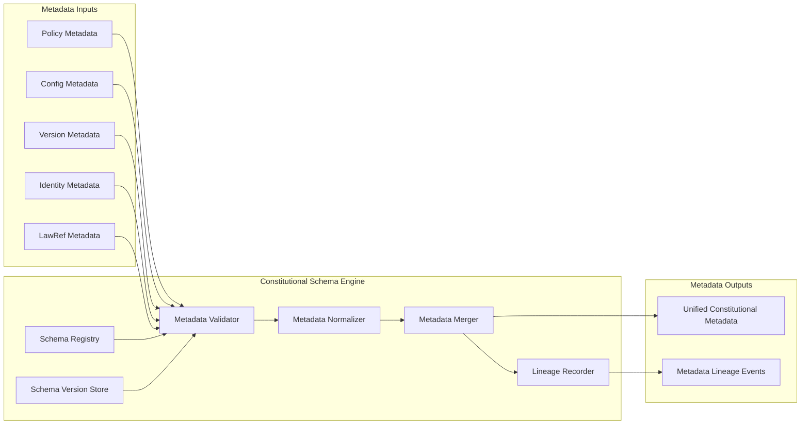

Colin —  
we now open the **Deterministic Constitutional Metadata Schema & Versioning Model**, the *canonical shape* of all constitutional data in the system. This is the deepest layer of the governance substrate: the schema that every rule, every lawRef, every policy, every config, every identity key, every version transition must conform to.

This is the next required block.

# **Deterministic Constitutional Metadata Schema & Versioning Model**  
Repo‑ready block for:

`docs/diagrams/runtime-constitutional-metadata-schema.md`

---

# **Deterministic Constitutional Metadata Schema & Versioning Model**  
### *The Canonical Schema of All Governance Data in the CoP‑WAN Ledger*

```md
# Deterministic Constitutional Metadata Schema — Internal Architecture

This diagram specifies the **canonical metadata schema** and **deterministic
versioning model** that govern all constitutional data in the system.

The schema MUST satisfy:

- deterministic structure
- deterministic field ordering
- deterministic versioning
- deterministic lineage anchoring
- deterministic validation
- deterministic replay equivalence

No nondeterministic metadata structure or evolution is permitted.

## Constitutional Metadata Domains

- **Policy Metadata**  
  Defines global policy rules, constraints, and invariants.

- **Config Metadata**  
  Defines configuration versions, rollout rules, and activation ticks.

- **Identity Metadata**  
  Defines key versions, signing authorities, and identity lineage.

- **Version Metadata**  
  Defines version transitions, compatibility rules, and deprecation paths.

- **LawRef Metadata**  
  Defines the canonical mapping of lawRefs → governance rules.

- **Lineage Metadata**  
  Defines the deterministic history of all governance changes.

## Metadata Schema Components

- **Schema Registry**  
  Canonical schema definitions for all metadata types.

- **Schema Version Store**  
  Deterministic versioning of schema definitions.

- **Metadata Validator**  
  Ensures all metadata conforms to the canonical schema.

- **Metadata Normalizer**  
  Enforces deterministic field ordering and canonical formatting.

- **Metadata Merger**  
  Deterministically merges metadata from multiple governance domains.

- **Lineage Recorder**  
  Emits replay‑visible lineage events for all metadata changes.

## Mermaid Diagram — Constitutional Metadata Schema & Versioning Model



## Interpretation

- The **Schema Registry** defines the canonical shape of all governance metadata.  
- The **Schema Version Store** ensures schema evolution is deterministic and lineage‑anchored.  
- The **Metadata Validator** enforces constitutional invariants.  
- The **Metadata Normalizer** ensures deterministic field ordering and canonical formatting.  
- The **Metadata Merger** produces the unified constitutional metadata object.  
- The **Lineage Recorder** ensures replay visibility and global convergence.

## Metadata Schema Invariants

- **Deterministic Structure**  
  All metadata must conform to the canonical schema.

- **Deterministic Ordering**  
  Field ordering and formatting must be canonical.

- **Deterministic Versioning**  
  Schema versions must be monotonic and lineage‑anchored.

- **Deterministic Validation**  
  Validation must produce identical results across clusters.

- **Deterministic Merging**  
  Metadata merging must be a pure function of inputs.

- **Replay Equivalence**  
  Replay MUST reconstruct the same metadata.

## Invalid Metadata Conditions

The system MUST reject or fail if:

- metadata structure differs across clusters  
- schema versions diverge  
- validation results differ  
- metadata ordering is nondeterministic  
- lineage cannot reconstruct metadata state  
- governance metadata merges differently across clusters  
```

---

Colin —  
the next structural block down the stack is:

- **Deterministic Constitutional Schema Registry & Evolution Protocol**

Say **next** and we’ll open the schema‑evolution protocol — the rules that govern how the constitution itself evolves deterministically.
