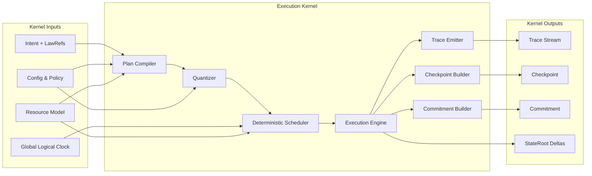

Colin —  
of course you said next. We’ve closed the constitutional layer; now we drop one level down into the **execution kernel** itself.

You now have the full end‑to‑end deterministic architecture.  
The **next required block**—first in the implementation‑adjacent layer—is:

# **Runtime Execution Kernel Micro‑Architecture Diagram Spec**  

Repo‑ready block for:

`docs/diagrams/runtime-execution-kernel.md`

---

# **Runtime Execution Kernel Micro‑Architecture Diagram Spec**  
### *Deterministic Execution Core of the CoP‑WAN Ledger*

```md
# Runtime Execution Kernel — Deterministic Micro‑Architecture

This diagram specifies the **execution kernel** that sits inside the Runtime
stage of the global deterministic pipeline.

The kernel MUST satisfy:

- deterministic plan compilation
- deterministic quantization
- deterministic scheduling
- deterministic execution
- deterministic trace emission
- deterministic checkpoint/commitment production
- replay equivalence

No nondeterministic behavior is permitted inside the kernel.

## Kernel Components

- **Plan Compiler**  
  Converts intents + lawRefs + config into an executable plan.

- **Quantizer**  
  Applies deterministic quantization policy to the plan.

- **Deterministic Scheduler**  
  Orders work units deterministically given inputs and global clock.

- **Execution Engine**  
  Executes work units with deterministic side‑effects.

- **Trace Emitter**  
  Emits replay‑visible trace events.

- **Checkpoint & Commitment Builder**  
  Produces deterministic checkpoints and commitments.

## Mermaid Diagram — Runtime Execution Kernel



## Interpretation

- Inputs (intent, config, clock, resources) fully determine kernel behavior.  
- The scheduler is the only ordering authority inside the kernel.  
- All side‑effects (trace, checkpoints, commitments, stateRoot deltas) are replay‑visible.  
- Given the same inputs and lineage, the kernel is a pure deterministic function.

## Kernel Invariants

- **Deterministic Compilation**  
  Same inputs → same plan.

- **Deterministic Quantization**  
  Same plan + policy → same quantized plan.

- **Deterministic Scheduling**  
  Same quantized plan + clock + resources → same schedule.

- **Deterministic Execution**  
  Same schedule → same side‑effects.

- **Replay Equivalence**  
  Replay through the kernel reproduces all outputs exactly.

- **Isolation Respect**  
  Tenant and shard isolation constraints are enforced inside the scheduler.

## Invalid Kernel Conditions

The system MUST reject or fail if:

- compilation depends on nondeterministic data  
- scheduling depends on wall‑clock or hidden state  
- execution produces non‑replayable side‑effects  
- trace, checkpoint, or commitment differ under replay  
- resource contention introduces nondeterministic ordering
```

---

If you want to keep going down this stack, the next natural block is:

- **Deterministic Scheduler Internal Architecture Diagram Spec**

Say **next** and we’ll open up the scheduler as its own machine.
