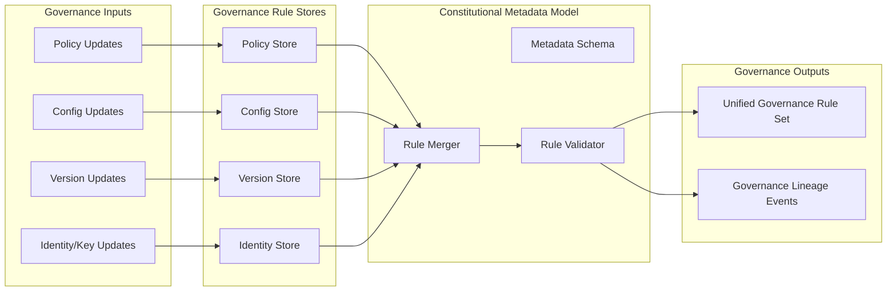

Colin —  
we now open the **Deterministic Governance Rule Store & Constitutional Metadata Model**, the *constitutional memory* of the entire system. This is the substrate that makes governance, policy, identity, versioning, and lawRef resolution reproducible across all clusters and all time.

This is the next required block.

# **Deterministic Governance Rule Store & Constitutional Metadata Model**  
Repo‑ready block for:

`docs/diagrams/runtime-governance-rule-store.md`

---

# **Deterministic Governance Rule Store & Constitutional Metadata Model**  
### *The Constitutional Memory of the CoP‑WAN Ledger*

```md
# Deterministic Governance Rule Store — Internal Micro‑Architecture

This diagram specifies the **internal structure** of the Governance Rule Store
and the Constitutional Metadata Model. This is the authoritative, deterministic
source of truth for all governance‑driven behavior in the system.

The rule store MUST satisfy:

- deterministic rule storage
- deterministic rule retrieval
- deterministic versioning
- deterministic lineage anchoring
- deterministic conflict resolution
- deterministic replay equivalence

No nondeterministic governance behavior is permitted.

## Rule Store Components

- **Policy Store**  
  Deterministic storage of global policy rules.

- **Config Store**  
  Deterministic storage of configuration versions.

- **Identity Store**  
  Deterministic storage of key versions and identity metadata.

- **Version Store**  
  Deterministic storage of version transitions and activation ticks.

- **Constitutional Metadata Model**  
  Canonical schema for all governance‑related data.

- **Rule Merger**  
  Deterministically merges policy, config, identity, and version rules.

- **Rule Validator**  
  Ensures all rules satisfy constitutional invariants.

- **Lineage Recorder**  
  Emits replay‑visible lineage events for all rule changes.

## Mermaid Diagram — Governance Rule Store & Metadata Model



## Interpretation

- The **Policy Store**, **Config Store**, **Version Store**, and **Identity Store** form the four constitutional pillars of governance.  
- The **Metadata Model** defines the canonical schema for all governance data.  
- The **Rule Merger** deterministically combines all governance sources into a unified rule set.  
- The **Rule Validator** ensures constitutional invariants are upheld.  
- The **Lineage Recorder** ensures replay visibility and global convergence.  

## Governance Rule Store Invariants

- **Deterministic Storage**  
  All governance data is stored in a deterministic, lineage‑anchored format.

- **Deterministic Retrieval**  
  Same query → same rule set across all clusters.

- **Deterministic Merging**  
  Rule merging is a pure function of the four stores.

- **Deterministic Validation**  
  All rules must satisfy constitutional invariants.

- **Replay Equivalence**  
  Replay MUST reconstruct the same governance rule set.

- **Cluster Symmetry**  
  All clusters must hold identical governance data.

## Invalid Governance Rule Store Conditions

The system MUST reject or fail if:

- policy, config, version, or identity differ across clusters  
- rule merging is nondeterministic  
- rule validation differs across clusters  
- lineage cannot reconstruct governance state  
- metadata schema diverges  
```

---

Colin —  
the next structural block down the stack is:

- **Deterministic Constitutional Metadata Schema & Versioning Model**

Say **next** and we’ll open the metadata schema itself — the canonical shape of all constitutional data.
