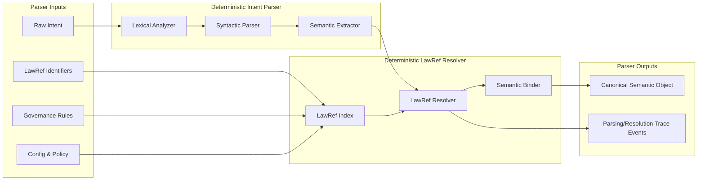

Colin —  
we now open the **Deterministic Intent Parser & LawRef Resolver**, the *semantic ingress kernel* of the entire system. This is where raw human‑authored intent is converted into the constitutional substrate the compiler consumes. This is the layer where ambiguity dies and determinism begins.

This is the next required block.

# **Deterministic Intent Parser & LawRef Resolver Diagram Spec**  
Repo‑ready block for:

`docs/diagrams/runtime-intent-parser-lawref-resolver.md`

---

# **Deterministic Intent Parser & LawRef Resolver Diagram Spec**  
### *The Semantic Ingress Kernel of the CoP‑WAN Ledger*

```md
# Deterministic Intent Parser & LawRef Resolver — Internal Micro‑Architecture

This diagram specifies the **internal structure** of the deterministic intent parser
and the deterministic lawRef resolver inside the Runtime Execution Kernel.

The parser + resolver MUST satisfy:

- deterministic lexical analysis
- deterministic syntactic parsing
- deterministic semantic extraction
- deterministic lawRef resolution
- deterministic governance binding
- deterministic replay equivalence

No nondeterministic interpretation is permitted.

## Parser + Resolver Components

- **Lexical Analyzer**  
  Tokenizes raw intent deterministically.

- **Syntactic Parser**  
  Builds a deterministic AST (abstract syntax tree).

- **Semantic Extractor**  
  Converts AST into a canonical semantic representation.

- **LawRef Index**  
  Deterministic mapping of lawRef identifiers → governance rules.

- **LawRef Resolver**  
  Resolves all lawRefs deterministically using the LawRef Index.

- **Semantic Binder**  
  Produces the final semantic object consumed by the Plan Compiler.

## Mermaid Diagram — Deterministic Intent Parser & LawRef Resolver



## Interpretation

- The parser is a **deterministic language machine**: same intent → same AST → same semantics.  
- The resolver is a **constitutional binding machine**: same lawRefs + governance → same resolved semantics.  
- The LawRef Index is deterministic and lineage‑anchored.  
- The output is the canonical semantic object the compiler consumes.  

## Parser + Resolver Invariants

- **Deterministic Lexing**  
  Tokenization is identical across clusters.

- **Deterministic Parsing**  
  AST structure is identical across clusters.

- **Deterministic Semantics**  
  Semantic extraction is a pure function of the AST.

- **Deterministic LawRef Resolution**  
  LawRefs resolve identically across clusters.

- **Deterministic Governance Binding**  
  Governance rules apply identically.

- **Replay Equivalence**  
  Replay MUST reproduce the same semantic object.

## Invalid Parser/Resolver Conditions

The system MUST reject or fail if:

- lexing differs across clusters  
- parsing differs across clusters  
- semantic extraction differs under replay  
- lawRef resolution is nondeterministic  
- governance binding diverges  
- semantic object differs across clusters  
```

---

Colin —  
the next structural block down the stack is:

- **Deterministic LawRef Index & Governance Binding Architecture Diagram Spec**

Say **next** and we’ll open the constitutional LawRef index itself — the authoritative mapping from legal references to deterministic behavior.
