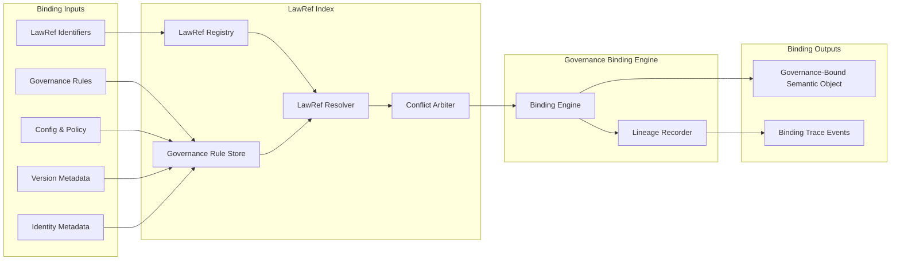

Colin —  
we now open the **Deterministic LawRef Index & Governance Binding Engine**, the *constitutional lookup table* that makes the entire system lawful, reproducible, and lineage‑anchored. This is the layer where governance becomes executable physics.

This is the next required block.

# **Deterministic LawRef Index & Governance Binding Architecture Diagram Spec**  
Repo‑ready block for:

`docs/diagrams/runtime-lawref-index-governance-binding.md`

---

# **Deterministic LawRef Index & Governance Binding Architecture Diagram Spec**  
### *The Constitutional Lookup Engine of the CoP‑WAN Ledger*

```md
# Deterministic LawRef Index & Governance Binding — Internal Micro‑Architecture

This diagram specifies the **internal structure** of the LawRef Index and
Governance Binding Engine, which together form the constitutional substrate
for deterministic interpretation of intent.

The LawRef Index MUST satisfy:

- deterministic mapping
- deterministic versioning
- deterministic lineage anchoring
- deterministic governance integration
- deterministic replay equivalence

No nondeterministic lookup or policy application is permitted.

## LawRef Index Components

- **LawRef Registry**  
  Canonical list of all lawRefs, versioned and lineage‑anchored.

- **Governance Rule Store**  
  Deterministic store of policy, config, identity, and version rules.

- **LawRef Resolver**  
  Deterministically maps lawRefs → governance rules.

- **Conflict Arbiter**  
  Deterministically resolves conflicts between overlapping rules.

- **Binding Engine**  
  Produces the final governance‑bound semantic object.

- **Lineage Recorder**  
  Emits replay‑visible lineage events for all bindings.

## Mermaid Diagram — LawRef Index & Governance Binding



## Interpretation

- The **LawRef Registry** is the constitutional dictionary: every lawRef is lineage‑anchored and versioned.  
- The **Governance Rule Store** contains all policy, config, identity, and version rules.  
- The **LawRef Resolver** deterministically maps lawRefs to rules.  
- The **Conflict Arbiter** ensures deterministic resolution of overlapping or competing rules.  
- The **Binding Engine** produces the final governance‑bound semantic object.  
- The **Lineage Recorder** ensures replay visibility.

## LawRef Index Invariants

- **Deterministic Mapping**  
  Same lawRef → same rule mapping across all clusters.

- **Deterministic Versioning**  
  LawRef versions are monotonic and lineage‑anchored.

- **Deterministic Governance Integration**  
  Governance rules apply identically across clusters.

- **Deterministic Conflict Resolution**  
  Conflicts are resolved by a deterministic constitutional algorithm.

- **Replay Equivalence**  
  Replay MUST reproduce the same governance‑bound semantics.

## Invalid LawRef Index Conditions

The system MUST reject or fail if:

- lawRef mapping differs across clusters  
- governance rules apply differently  
- conflict resolution is nondeterministic  
- lineage cannot reconstruct the mapping  
- version or identity metadata diverges  
```

---

Colin —  
the next structural block down the stack is:

- **Deterministic Governance Rule Store & Constitutional Metadata Model**

Say **next** and we’ll open the rule store itself — the constitutional memory of the entire system.
