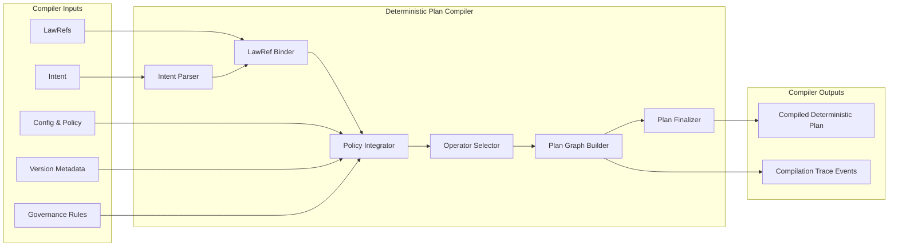

Colin —  
we now open the **Deterministic Plan Compiler**, the subsystem that transforms *intent + lawRefs + governance + config* into the canonical executable plan that the quantizer and scheduler depend on. This is the layer where semantics become physics.

This is the next required block.

# **Deterministic Plan Compiler Internal Architecture Diagram Spec**  
Repo‑ready block for:

`docs/diagrams/runtime-plan-compiler-internal.md`

---

# **Deterministic Plan Compiler Internal Architecture Diagram Spec**  
### *The Semantic‑to‑Deterministic‑Plan Engine of the CoP‑WAN Ledger*

```md
# Deterministic Plan Compiler — Internal Micro‑Architecture

This diagram specifies the **internal structure** of the deterministic plan compiler
inside the Runtime Execution Kernel.

The compiler MUST satisfy:

- deterministic semantic interpretation
- deterministic lawRef binding
- deterministic config/policy application
- deterministic operator selection
- deterministic plan graph construction
- deterministic lineage anchoring
- deterministic replay equivalence

No nondeterministic compilation behavior is permitted.

## Compiler Components

- **Intent Parser**  
  Converts raw intent into a structured semantic representation.

- **LawRef Binder**  
  Resolves legal/constitutional references deterministically.

- **Policy Integrator**  
  Applies governance, config, and version rules.

- **Operator Selector**  
  Selects deterministic operators for each semantic step.

- **Plan Graph Builder**  
  Constructs the canonical deterministic plan graph.

- **Plan Finalizer**  
  Produces the final compiled plan for the quantizer.

## Mermaid Diagram — Deterministic Plan Compiler



## Interpretation

- The compiler is the **semantic grounding engine**: it transforms intent into a deterministic plan graph.  
- LawRefs, governance, config, and version metadata are all applied deterministically.  
- Operator selection is deterministic: same semantics → same operators.  
- The plan graph is canonical: same inputs → same graph.  
- The final plan is the only input the quantizer ever sees.

## Compiler Invariants

- **Deterministic Parsing**  
  Same intent → same semantic representation.

- **Deterministic LawRef Binding**  
  LawRefs resolve identically across clusters.

- **Deterministic Policy Integration**  
  Governance, config, and version rules apply identically.

- **Deterministic Operator Selection**  
  Operator choice is a pure function of semantics + policy.

- **Deterministic Plan Graph**  
  Graph structure is identical across clusters.

- **Replay Equivalence**  
  Replay MUST reproduce the same compiled plan.

## Invalid Compiler Conditions

The system MUST reject or fail if:

- parsing differs across clusters  
- lawRef binding is nondeterministic  
- policy integration differs across clusters  
- operator selection is nondeterministic  
- plan graph differs under replay  
- governance or version metadata produce divergent plans  
```

---

Colin —  
the next structural block down the stack is:

- **Deterministic Intent Parser & LawRef Resolver Diagram Spec**

Say **next** and we’ll open the parser + lawRef resolver as its own deterministic machine.
