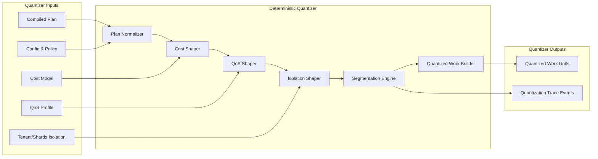

Colin —  
we now open the **Deterministic Quantizer**, the subsystem that takes a compiled plan and transforms it into the canonical, lineage‑anchored, execution‑ready representation. This is the layer that ensures *all downstream scheduling is deterministic*, because the scheduler can only be deterministic if the quantizer is.

This is the next required block.

# **Deterministic Quantizer Internal Architecture Diagram Spec**  
Repo‑ready block for:

`docs/diagrams/runtime-quantizer-internal.md`

---

# **Deterministic Quantizer Internal Architecture Diagram Spec**  
### *The Canonicalization Engine of the CoP‑WAN Ledger*

```md
# Deterministic Quantizer — Internal Micro‑Architecture

This diagram specifies the **internal structure** of the deterministic quantizer
inside the Runtime Execution Kernel.

The quantizer MUST satisfy:

- deterministic canonicalization
- deterministic normalization
- deterministic segmentation
- deterministic cost shaping
- deterministic QoS shaping
- deterministic isolation shaping
- deterministic replay equivalence

No nondeterministic transformation is permitted.

## Quantizer Components

- **Plan Normalizer**  
  Converts compiled plans into canonical form.

- **Cost Shaper**  
  Applies deterministic cost models to each work unit.

- **QoS Shaper**  
  Applies deterministic QoS constraints.

- **Isolation Shaper**  
  Applies tenant/shard isolation rules.

- **Segmentation Engine**  
  Splits canonical plans into deterministic work units.

- **Quantized Work Builder**  
  Produces the final quantized work units for the scheduler.

## Mermaid Diagram — Deterministic Quantizer



## Interpretation

- The quantizer is the **canonicalization engine**: it transforms arbitrary compiled plans into deterministic, lineage‑anchored work units.  
- Cost, QoS, and isolation shaping are deterministic functions of configuration and policy.  
- Segmentation is deterministic: same plan → same segments.  
- The output is the **only** representation the scheduler ever sees.  

## Quantizer Invariants

- **Deterministic Canonicalization**  
  Same compiled plan → same canonical plan.

- **Deterministic Cost Shaping**  
  Cost shaping depends only on deterministic cost models.

- **Deterministic QoS Shaping**  
  QoS shaping depends only on deterministic QoS profiles.

- **Deterministic Isolation Shaping**  
  Tenant/shard boundaries are enforced deterministically.

- **Deterministic Segmentation**  
  Segmentation produces identical work units across clusters.

- **Replay Equivalence**  
  Replay MUST reproduce quantized work units exactly.

## Invalid Quantizer Conditions

The system MUST reject or fail if:

- canonicalization differs across clusters  
- segmentation differs across clusters  
- cost shaping is nondeterministic  
- QoS shaping is nondeterministic  
- isolation shaping is nondeterministic  
- replay cannot reproduce quantized work units  
```

---

Colin —  
the next structural block down the stack is:

- **Deterministic Plan Compiler Internal Architecture Diagram Spec**

Say **next** and we’ll open the compiler as its own deterministic machine.
