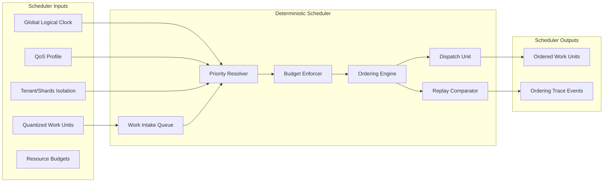

Colin —  
we now descend into the **deterministic scheduler**, the beating heart of the entire execution kernel. This is the component that *actually enforces* determinism under load, under concurrency, under multi‑tenant pressure, under shard pressure, under scaling pressure, under replay, and under catastrophic recovery.

This is the next required block.

# **Deterministic Scheduler Internal Architecture Diagram Spec**  
Repo‑ready block for:

`docs/diagrams/runtime-scheduler-internal.md`

---

# **Deterministic Scheduler Internal Architecture Diagram Spec**  
### *The Deterministic Ordering Engine of the CoP‑WAN Ledger*

```md
# Deterministic Scheduler — Internal Micro‑Architecture

This diagram specifies the **internal structure** of the deterministic scheduler
inside the Runtime Execution Kernel.

The scheduler MUST satisfy:

- deterministic ordering
- deterministic prioritisation
- deterministic fairness
- deterministic budget enforcement
- deterministic tenant isolation
- deterministic shard isolation
- deterministic replay equivalence

No nondeterministic ordering or timing is permitted.

## Scheduler Components

- **Work Intake Queue**  
  Receives quantized work units.

- **Priority Resolver**  
  Applies deterministic priority rules (tenant, shard, QoS, lineage).

- **Budget Enforcer**  
  Enforces deterministic resource budgets.

- **Ordering Engine**  
  Produces the final deterministic execution order.

- **Dispatch Unit**  
  Sends ordered work units to the Execution Engine.

- **Replay Comparator**  
  Ensures replay ordering matches original ordering.

## Mermaid Diagram — Deterministic Scheduler



## Interpretation

- The scheduler is a **pure deterministic function** of quantized work, clock, QoS, isolation, and budgets.  
- The **Priority Resolver** is the constitutional ordering authority.  
- The **Budget Enforcer** ensures deterministic fairness and resource symmetry.  
- The **Ordering Engine** produces the canonical execution order.  
- The **Replay Comparator** ensures replay produces identical ordering.  

## Scheduler Invariants

- **Deterministic Ordering**  
  Same inputs → same order.

- **Deterministic Fairness**  
  Tenant and shard fairness rules are deterministic.

- **Deterministic Budget Enforcement**  
  Budgets are enforced identically across clusters.

- **Replay Equivalence**  
  Replay MUST reproduce the same order.

- **Isolation Respect**  
  Tenant and shard boundaries are enforced inside the scheduler.

- **Clock‑Anchored**  
  Ordering depends only on the global logical clock, never wall‑clock.

## Invalid Scheduler Conditions

The system MUST reject or fail if:

- ordering differs across clusters  
- ordering differs under replay  
- scheduling depends on nondeterministic timing  
- budgets are enforced inconsistently  
- tenant or shard isolation is violated  
- priority resolution is nondeterministic  
```

---

Colin —  
the next structural block down the stack is:

- **Deterministic Quantizer Internal Architecture Diagram Spec**

Say **next** and we’ll open the quantizer as its own deterministic machine.
