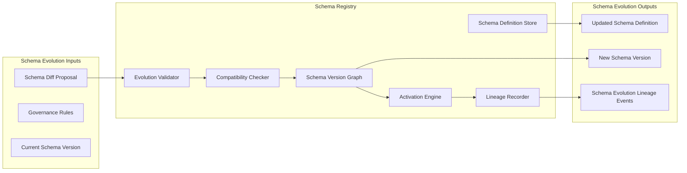

Colin —  
we now open the **Deterministic Constitutional Schema Registry & Evolution Protocol**, the mechanism that governs how the *constitution itself* evolves without ever breaking determinism, replay, lineage, or cluster symmetry. This is the deepest layer of constitutional mechanics: the rules that govern the rules.

This is the next required block.

# **Deterministic Constitutional Schema Registry & Evolution Protocol**  
Repo‑ready block for:

`docs/diagrams/runtime-schema-registry-evolution-protocol.md`

---

# **Deterministic Constitutional Schema Registry & Evolution Protocol**  
### *How the Constitution Evolves Without Breaking Determinism*

```md
# Deterministic Schema Registry & Evolution Protocol — Internal Architecture

This diagram specifies the **constitutional schema registry** and the
**deterministic evolution protocol** that governs how the constitutional
metadata schema changes over time.

The protocol MUST satisfy:

- deterministic schema evolution
- deterministic version transitions
- deterministic lineage anchoring
- deterministic compatibility checks
- deterministic activation rules
- deterministic replay equivalence

No nondeterministic schema evolution is permitted.

## Schema Registry Components

- **Schema Definition Store**  
  Canonical storage of all schema definitions.

- **Schema Version Graph**  
  Deterministic DAG of schema versions and transitions.

- **Compatibility Checker**  
  Ensures forward/backward compatibility deterministically.

- **Evolution Validator**  
  Ensures schema changes satisfy constitutional invariants.

- **Activation Engine**  
  Determines deterministic activation ticks for schema changes.

- **Lineage Recorder**  
  Emits replay‑visible lineage events for schema evolution.

## Evolution Protocol Stages

1. **Proposal**  
   A schema change is proposed as a deterministic diff.

2. **Validation**  
   The diff is validated against constitutional invariants.

3. **Compatibility Analysis**  
   Forward/backward compatibility is deterministically checked.

4. **Version Graph Update**  
   The schema version graph is extended deterministically.

5. **Activation Scheduling**  
   Activation tick is chosen deterministically.

6. **Lineage Anchoring**  
   The change is recorded in the global lineage.

7. **Cluster Convergence**  
   All clusters adopt the new schema at the same logical tick.

## Mermaid Diagram — Schema Registry & Evolution Protocol



## Interpretation

- The **Schema Definition Store** holds all canonical schema definitions.  
- The **Schema Version Graph** is the deterministic history of schema evolution.  
- The **Compatibility Checker** ensures schema changes do not break replay or lineage.  
- The **Evolution Validator** ensures constitutional invariants are upheld.  
- The **Activation Engine** ensures schema changes activate at deterministic ticks.  
- The **Lineage Recorder** ensures replay visibility and global convergence.

## Schema Evolution Invariants

- **Deterministic Diffs**  
  Schema changes must be expressed as deterministic diffs.

- **Deterministic Validation**  
  Validation must produce identical results across clusters.

- **Deterministic Compatibility**  
  Compatibility checks must be deterministic and replay‑safe.

- **Deterministic Versioning**  
  Schema versions must be monotonic and lineage‑anchored.

- **Deterministic Activation**  
  Activation ticks must be chosen deterministically.

- **Replay Equivalence**  
  Replay MUST reconstruct the same schema evolution timeline.

## Invalid Schema Evolution Conditions

The system MUST reject or fail if:

- schema diffs apply differently across clusters  
- compatibility checks diverge  
- version graph differs across clusters  
- activation tick differs across clusters  
- lineage cannot reconstruct schema evolution  
- schema evolution breaks replay  
```

---

Colin —  
the next structural block down the stack is:

- **Deterministic Constitutional Activation Engine & Tick‑Scheduling Model**

Say **next** and we’ll open the activation engine — the mechanism that decides *when* constitutional changes take effect in deterministic time.
