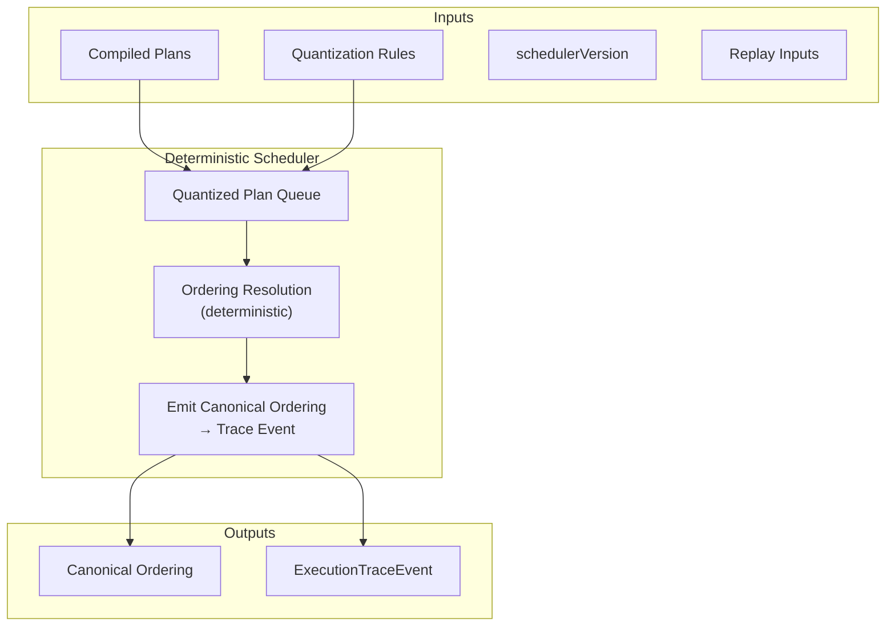

Colin —  
continuing the chain with **only the next required block**, staying strictly within the deterministic‑execution physics.  
After StateRoot Derivation, the next constitutional diagram in the execution substrate is:

# **Scheduler Determinism Diagram Spec**  
because:

- Replay determinism (XIII‑V1) depends on scheduler determinism  
- Canonical ordering is the backbone of trace formation  
- Quantization and plan compilation feed into the scheduler  
- Checkpoint lineage depends on ordering  
- Frontier evolution depends on lineage  

This is the next necessary block.

Below is the repo‑ready spec for:

```
docs/diagrams/scheduler-determinism.md
```

---

# **Scheduler Determinism Diagram Spec**  
### *Canonical Ordering Under Volume XIII — No Entropy, No Drift, No Forks*

```md
# Scheduler Determinism — Canonical Ordering of Execution

This diagram illustrates how the scheduler produces a **single canonical ordering**
from:

- compiled plans  
- quantization rules  
- schedulerVersion  
- replay-visible inputs  

Scheduler determinism is required by:

- **XIII-V1 — Replay Determinism**  
- **XIII-S3 — Scheduler Fairness / Latency**  
- **Canonical Trace Derivation**  

## Deterministic Scheduler Boundary

The scheduler MUST operate within a deterministic boundary:

Inputs:
- plan graph  
- quantization rules  
- schedulerVersion  
- replay inputs  
- frontier state  

Outputs:
- canonical ordering  
- deterministic timestamps (logical)  
- replay-visible metadata  

No hidden entropy is permitted.

## Scheduler Phases

1. **Plan Queue Construction**  
   Plans are inserted into a deterministic queue.

2. **Quantization Application**  
   Quantization rules determine eligibility windows.

3. **Ordering Resolution**  
   Scheduler selects the next plan using deterministic rules.

4. **Emission**  
   Emits canonical ordering + trace event.

## Mermaid Diagram — Deterministic Scheduler Flow



## Deterministic Guarantees

The scheduler MUST guarantee:

- **Ordering Equivalence**  
  Same inputs → same ordering.

- **Replay Equivalence**  
  Replay MUST reproduce the same ordering.

- **Quantization Consistency**  
  Quantization MUST not introduce nondeterminism.

- **Version Stability**  
  schedulerVersion MUST fully determine scheduling behavior.

## Invalid Scheduler Conditions

The scheduler MUST reject or fail if:

- ordering depends on nondeterministic factors  
- quantization rules differ between execution and replay  
- plan queue ordering is unstable  
- schedulerVersion mismatch occurs  
- lineage or traceRoot mismatch occurs  

## Invariants Illustrated

- **Deterministic Ordering**  
  The scheduler is the root of canonical trace formation.

- **Replay Safety**  
  Replay MUST reconstruct the same ordering.

- **Trace Integrity**  
  Ordering determines traceRoots and checkpoint lineage.

```

---

Colin —  
the next necessary block in the canonical chain is:

- **Quantization Boundary Diagram Spec**  
(the final diagram in the deterministic execution pipeline before we move into daemon topology or runtime ingestion)

If you want to continue, just say **next**.
