Colin —  
continuing the chain with **only the next required block**, staying perfectly aligned with the constitutional superstructure you’ve been building.

You now have:

- Global WAN orchestration  
- Observability topology  
- Recovery & reconciliation  
- Global logical clock  
- Global resource model  

The **next necessary block** in the canonical chain is:

# **Security / Trust Boundary Diagram Spec**  
This is required because:

- Deterministic systems must have deterministic trust boundaries  
- Clusters must authenticate segments before linking  
- Relays must validate provenance  
- Ingest must authenticate intents  
- Runtime must enforce lawRefs  
- WAN propagation must preserve trust domains  
- Recovery must not cross trust boundaries incorrectly  

Below is the repo‑ready block for:

```
docs/diagrams/security-trust-boundary.md
```

---

# **Security / Trust Boundary Diagram Spec**  
### *Deterministic Trust Domains Across the CoP‑WAN Ledger*

```md
# Security & Trust Boundaries — Deterministic Trust Domains

This diagram illustrates the **constitutional trust boundaries** that govern
the CoP‑WAN Ledger.

Trust boundaries MUST satisfy:

- deterministic authentication  
- deterministic authorization  
- deterministic provenance validation  
- deterministic relay propagation  
- deterministic frontier advancement  

No nondeterministic security decisions are permitted.

## Trust Domain Model

TrustDomain {
  ingestDomain: AuthDomain
  runtimeDomain: AuthDomain
  relayDomain: AuthDomain
  meshDomain: AuthDomain
}

Each domain MUST:

- authenticate inputs  
- validate provenance  
- enforce lawRefs  
- reject nondeterministic or unverifiable data  

## Security Layers

### Ingest Security
- authenticate intent origin  
- validate lawRefs  
- ensure replay‑visible provenance  

### Runtime Security
- enforce deterministic plan compilation  
- validate quantization rules  
- validate schedulerVersion  
- ensure trace events are canonical  

### Relay Security
- validate checkpoint signatures  
- validate segment lineage  
- enforce validation window  
- enforce frontier continuity  

### Mesh Security
- authenticate relay peers  
- validate propagation paths  
- ensure deterministic fan‑out  

## Mermaid Diagram — Security & Trust Boundaries

```mermaid
flowchart LR

    subgraph Ingest["Ingest Domain"]
        I_IN["Intent Input"]
        I_AUTH["Auth & Provenance Check"]
        I_OUT["Ingest Event"]
    end

    subgraph Runtime["Runtime Domain"]
        R_IN["Plan Input"]
        R_AUTH["LawRef & Version Check"]
        R_OUT["Trace / Checkpoint"]
    end

    subgraph Relay["Relay Domain"]
        L_IN["Checkpoint Input"]
        L_AUTH["Signature & Lineage Check"]
        L_OUT["Propagated Segment"]
    end

    subgraph Mesh["Mesh Domain"]
        M_IN["Incoming Segment"]
        M_AUTH["Peer Auth & Path Validation"]
        M_OUT["Accepted Segment"]
    end

    I_IN --> I_AUTH --> I_OUT --> R_IN
    R_IN --> R_AUTH --> R_OUT --> L_IN
    L_IN --> L_AUTH --> L_OUT --> M_IN
    M_IN --> M_AUTH --> M_OUT
```



## Interpretation

- Each domain has its own **trust boundary**.  
- Data crossing a boundary MUST be authenticated and validated.  
- No domain may accept unverifiable or nondeterministic data.  
- Trust boundaries enforce deterministic security across the WAN.  
- Relay and mesh domains ensure global continuation safety.  

## Security Invariants

The system MUST guarantee:

- **Deterministic Authentication**  
  Same input → same auth decision.

- **Deterministic Authorization**  
  No nondeterministic policy evaluation.

- **Provenance Integrity**  
  All data MUST be lineage‑anchored.

- **Mesh Trust Symmetry**  
  All clusters enforce identical trust rules.

- **Replay‑Safe Security**  
  Replay MUST reproduce all security decisions.

## Invalid Security Conditions

The system MUST reject or fail if:

- provenance cannot be validated  
- signatures mismatch  
- lineage mismatch occurs  
- relay peer cannot be authenticated  
- mesh path is invalid  
- lawRefs differ between execution and replay  
- schedulerVersion mismatch occurs  

## Invariants Illustrated

- **Deterministic Trust**  
  Security decisions are part of the deterministic physics.

- **WAN‑Scale Trust Symmetry**  
  All clusters enforce identical trust boundaries.

- **Continuation Safety**  
  Only authenticated, lineage‑valid segments propagate.

```

---

Colin —  
the next optional‑but‑structural block in the chain is:

- **Ingress Load‑Balancing Diagram Spec**

If you want to continue, just say **next**.
