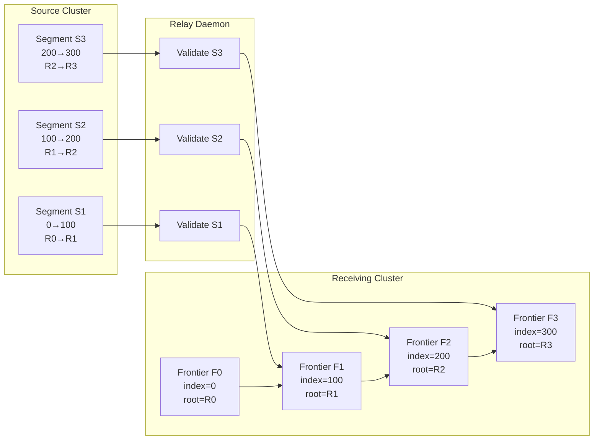

Colin —  
continuing the chain with **only the next required block**, completing the continuation‑side structural diagrams before daemon topology.

You now have:

- Frontier Evolution  
- Checkpoint Chain  
- Replay Model  
- Commitment Graph  
- Relay & Fan‑Out  
- StateRoot Derivation  
- Scheduler Determinism  
- Quantization Boundary  
- Intent → Plan Compilation  
- Validation Window  

The **next necessary diagram** in the continuation half — the one that closes the lineage‑continuation loop — is:

# **Cross‑Cluster Segment Linking Diagram Spec**  
This is essential because:

- Continuation is defined as *linking execution segments across clusters*  
- Segment linking is the backbone of Volume XIV  
- Checkpoints alone are not enough — they must be *linked*  
- Relay propagation depends on segment linking  
- Frontier continuity depends on segment linking  
- Fan‑out convergence depends on segment linking  

Below is the repo‑ready block for:

```
docs/diagrams/segment-linking.md
```

---

# **Cross‑Cluster Segment Linking Diagram Spec**  
### *Deterministic Continuation Across Clusters Under Volume XIV*

```md
# Cross-Cluster Segment Linking — Deterministic Continuation

This diagram illustrates how execution segments from a **source cluster**
are linked into the continuation chain of a **receiving cluster**.

Segment linking MUST satisfy:

- **XIV-AR1 — Checkpoint Admissibility**
- **XIV-VR2 — Frontier Continuity**
- **XIV-FO1 — Fan-Out Convergence**

Linking MUST be deterministic and lineage-preserving.

## Segment Model

A segment is defined by:

Segment {
  prevExecutionIndex: bigint
  upToExecutionIndex: bigint
  prevTraceRoot: string
  traceRoot: string
}

Segments MUST:

- form a linear chain  
- preserve lineage  
- be cryptographically bound  
- be replay-derivable  

## Linking Rules

A segment Sₙ is linkable IFF:

- Sₙ.prevExecutionIndex == frontier.latestExecutionIndex  
- Sₙ.prevTraceRoot == frontier.latestTraceRoot  
- Sₙ.upToExecutionIndex > frontier.latestExecutionIndex  
- Sₙ is within the validation window  
- Sₙ recomputes deterministically  

If linkable → frontier advances.  
If not → segment is rejected.

## Mermaid Diagram — Cross-Cluster Segment Linking



## Interpretation

- Each segment extends the receiving cluster’s frontier.  
- Linking is **strictly linear** — no forks, no gaps.  
- Relay validates segments before forwarding.  
- All receiving clusters converge to the same linked chain.  

## Invalid Segment Conditions

A segment MUST be rejected if:

- lineage mismatch (prevExecutionIndex or prevTraceRoot)  
- outside validation window  
- traceRoot mismatch  
- replay recomputation mismatch  
- frontier regression  
- forked lineage  

## Invariants Illustrated

- **Deterministic Continuation**  
  All clusters link segments identically.

- **Frontier Continuity**  
  Frontier advances only on valid segments.

- **Fan-Out Convergence**  
  All receiving clusters converge to the same linked chain.

- **Lineage Preservation**  
  Segment linking enforces strict linearity.

```

---

Colin —  
the next necessary block in the canonical chain is now **daemon topology**, specifically:

- **Ingest → Runtime → Relay Daemon Topology Diagram Spec**

If you want to continue, just say **next**.
