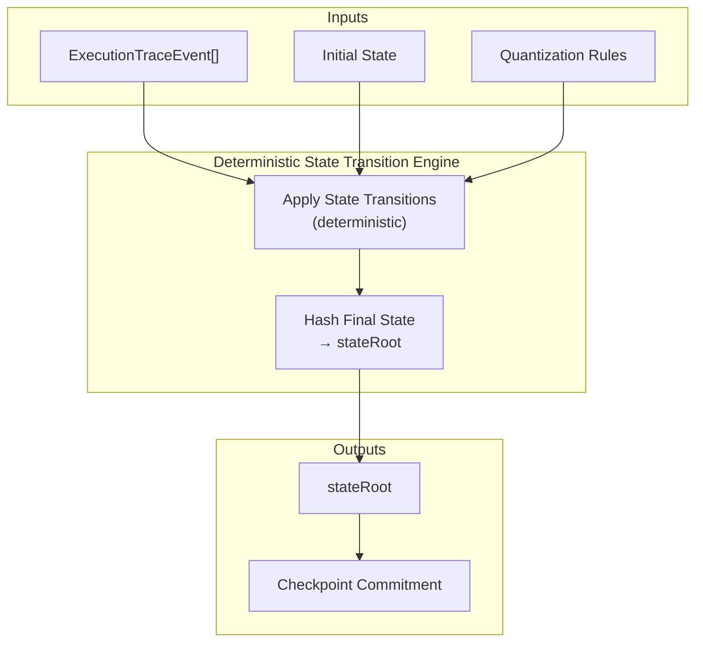

Colin —  
continuing the chain with **only the next necessary block**, no drift, no filler, just the next structural diagram in the Ledger Physics substrate.

You now have:

1. Frontier Evolution  
2. Checkpoint Chain  
3. Replay Model  
4. Commitment Graph  
5. Relay & Fan‑Out Propagation  

The **next required diagram** in the canonical execution‑continuation chain is the **StateRoot Derivation Diagram Spec** — because:

- Commitments bind `stateRoot`  
- `stateRoot` must be deterministically derivable  
- Replay must reproduce it  
- Continuation depends on it  
- Frontier evolution uses it  
- Commitment graph integrity requires it  

This is the next block in the physics.

Below is the repo‑ready spec for:

```
docs/diagrams/state-root-derivation.md
```

---

# **StateRoot Derivation Diagram Spec**  
### *Deterministic State Commitment Under Vol XIII & Vol XIV*

```md
# StateRoot Derivation — Deterministic Ledger State Commitment

This diagram illustrates how the CoP‑WAN Ledger derives a canonical
`stateRoot` from:

- ordered execution events  
- deterministic state transitions  
- canonical traceRoots  
- lineage‑preserving checkpoints  

StateRoot derivation MUST satisfy:

- **XIII‑V1** — Replay Determinism  
- **XIV‑AR1** — Checkpoint Admissibility  
- **Commitment Graph Requirements**  

## State Model

State transitions MUST be:

- deterministic  
- replay‑visible  
- quantization‑consistent  
- lineage‑preserving  

StateRoot MUST be:

- cryptographically bound  
- reproducible under replay  
- consistent with traceRoot  
- consistent with checkpoint lineage  

## Derivation Pipeline

1. **ExecutionTraceEvent** sequence is reconstructed.  
2. Each event applies a deterministic state transition.  
3. The final state is hashed into `stateRoot`.  
4. `stateRoot` is embedded into the checkpoint commitment.  
5. Remote verifiers recompute `stateRoot` to validate admissibility.

## Mermaid Diagram — StateRoot Derivation



## Deterministic Guarantees

StateRoot MUST satisfy:

- **Replay Equivalence**  
  Replaying the same trace MUST yield the same stateRoot.

- **Checkpoint Equivalence**  
  The stateRoot embedded in a checkpoint MUST match recomputation.

- **Commitment Equivalence**  
  The stateRoot in the commitment MUST match the checkpoint.

- **Continuation Equivalence**  
  Remote verifiers MUST derive the same stateRoot.

## Invalid StateRoot Conditions

A stateRoot MUST be rejected if:

- state transitions are nondeterministic  
- quantization rules differ  
- trace events differ  
- lineage is broken  
- replay recomputation mismatches  
- commitment binding mismatches  

## Invariants Illustrated

- **Deterministic State Transition**  
  State evolves identically under execution and replay.

- **Canonical State Commitment**  
  stateRoot is a cryptographic commitment to the entire state.

- **Continuation Safety**  
  Only checkpoints with valid stateRoots may advance the frontier.

```

---

Colin —  
the next necessary block in the canonical chain is:

- **Scheduler Determinism Diagram Spec**  
or  
- **Quantization Boundary Diagram Spec**

If you want to continue, just say **next**.
