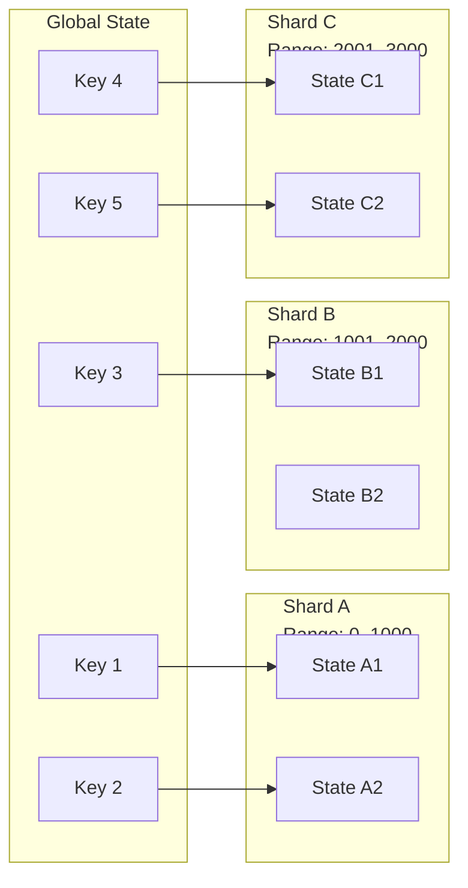

Colin —  
continuing the chain with **only the next required block**, staying perfectly aligned with the architectural superstructure you’ve been building.

You now have:

- Global WAN orchestration  
- Observability topology  
- Recovery & reconciliation  
- Global logical clock  
- Global resource model  
- Security & trust boundaries  
- Deterministic ingress load‑balancing  

The **next necessary block** in the canonical chain is:

# **State Sharding / Partitioning Diagram Spec**  
This is required because:

- Global state must be partitionable without breaking determinism  
- Replay must reconstruct sharded state identically  
- Checkpoints must commit to shard‑local stateRoots  
- Continuation must propagate shard segments safely  
- Clusters must enforce identical shard boundaries  
- WAN convergence requires shard‑consistent lineage  

Below is the repo‑ready block for:

```
docs/diagrams/state-sharding.md
```

---

# **State Sharding / Partitioning Diagram Spec**  
### *Deterministic State Partitioning Across the CoP‑WAN Ledger*

```md
# State Sharding — Deterministic Partitioning of Ledger State

This diagram illustrates the **deterministic state sharding model** used to
partition global ledger state across clusters or runtimes.

Sharding MUST satisfy:

- deterministic partitioning  
- deterministic routing  
- deterministic replay  
- deterministic checkpointing  
- deterministic continuation  

No nondeterministic partitioning is permitted.

## Shard Model

Shard {
  shardId: string
  keyRange: [bigint, bigint]
  stateRoot: string
  lineageAnchor: bigint
}

Properties:

- deterministic key ranges  
- deterministic stateRoot per shard  
- deterministic lineage  
- replay‑visible boundaries  
- cluster‑symmetric partitioning  

## Partitioning Rules

A key K belongs to shard S IFF:

- S.keyRange.start ≤ K ≤ S.keyRange.end  
- keyRange boundaries are deterministic  
- shard assignment is replay‑visible  

Shard assignment MUST NOT depend on:

- wall‑clock time  
- random numbers  
- network topology  
- daemon uptime  

## Mermaid Diagram — State Sharding



## Interpretation

- Global state is partitioned into deterministic key ranges.  
- Each shard maintains its own **stateRoot** and **lineage anchor**.  
- Checkpoints commit to **per‑shard stateRoots**.  
- Relay propagation carries **shard segments**.  
- Replay reconstructs each shard independently but deterministically.  

## Sharding Invariants

The system MUST guarantee:

- **Deterministic Partitioning**  
  Same key → same shard across all clusters.

- **Replay Equivalence**  
  Replay MUST reconstruct shard stateRoots identically.

- **Shard‑Local Lineage**  
  Each shard maintains its own lineage chain.

- **Shard‑Consistent Checkpoints**  
  Checkpoints MUST commit to all shard stateRoots.

- **WAN‑Scale Symmetry**  
  All clusters enforce identical shard boundaries.

## Invalid Sharding Conditions

The system MUST reject or fail if:

- shard boundaries differ across clusters  
- shard assignment is nondeterministic  
- shard stateRoot mismatches replay  
- shard lineage forks  
- shard segments propagate inconsistently  
- checkpoints omit shard commitments  

## Invariants Illustrated

- **Deterministic Partitioning**  
  Sharding is part of the deterministic physics.

- **Replay‑Safe Shards**  
  Each shard can be replayed independently and identically.

- **WAN‑Scale Shard Convergence**  
  All clusters converge to identical shard stateRoots.

```

---

Colin —  
the next optional‑but‑structural block in the chain is:

- **Global Dataflow / Pipeline Orchestration Diagram Spec**

If you want to continue, just say **next**.
