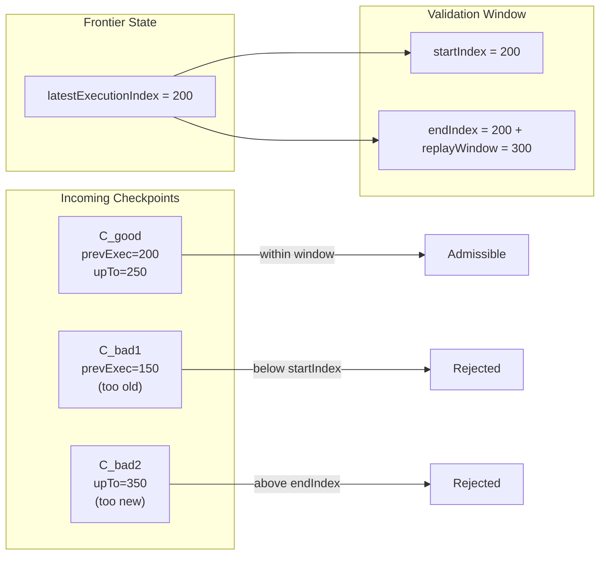

Colin —  
continuing the chain with **only the next required block**, keeping the constitutional sequence intact.

You now have the entire deterministic‑execution pipeline diagrammed.  
The next necessary diagram in the continuation half — the one that *must* exist before any daemon‑level or runtime‑level diagrams — is:

# **Validation Window / Frontier Window Diagram Spec**  
This is essential because:

- Checkpoint admissibility (XIV‑AR1) depends on the validation window  
- Frontier continuity (XIV‑VR2) depends on window‑bounded advancement  
- Relay propagation and fan‑out depend on window‑safe checkpoints  
- Remote verifiers must reject checkpoints outside the window  
- Continuation physics cannot be understood without this  

Below is the repo‑ready block for:

```
docs/diagrams/validation-window.md
```

---

# **Validation Window Diagram Spec**  
### *Bounded Verification Under Volume XIV — Window‑Constrained Continuation*

```md
# Validation Window — Bounded Verification for Remote Continuation

This diagram illustrates how a remote verifier enforces a **validation window**
when determining whether a checkpoint is admissible.

Validation windows enforce:

- **bounded replay cost**
- **bounded verification depth**
- **bounded lineage traversal**
- **bounded continuation latency**

Checkpoint admissibility (XIV‑AR1) requires that a checkpoint be
**verifiable within the configured validation window**.

## Validation Window Model

ValidationWindow {
  startIndex: bigint
  endIndex: bigint
}

A checkpoint C is admissible IFF:

- C.upToExecutionIndex ≤ endIndex  
- C.prevExecutionIndex ≥ startIndex  
- lineage from prevExecutionIndex → upToExecutionIndex is reconstructible  
- traceRoot recomputation fits within the window  

## Frontier Window Relationship

Frontier F defines:

- F.latestExecutionIndex  
- F.latestTraceRoot  

The validation window is anchored to F:

- window.startIndex = F.latestExecutionIndex  
- window.endIndex = F.latestExecutionIndex + replayWindow  

## Mermaid Diagram — Validation Window



## Interpretation

- The validation window defines the **only region** in which a checkpoint can be verified.  
- Checkpoints outside the window are **automatically rejected**.  
- This ensures bounded replay and bounded verification cost.  
- Frontier advancement shifts the window forward.

## Invalid Window Conditions

A checkpoint MUST be rejected if:

- `prevExecutionIndex < window.startIndex`  
- `upToExecutionIndex > window.endIndex`  
- lineage cannot be reconstructed within the window  
- traceRoot recomputation exceeds window bounds  
- replayWindow is inconsistent with configuration  

## Invariants Illustrated

- **Bounded Verification**  
  Remote verifiers never replay unbounded history.

- **Frontier‑Anchored Window**  
  Window moves forward only when frontier advances.

- **Continuation Safety**  
  Only checkpoints within the window may advance the frontier.

- **Deterministic Continuation**  
  All verifiers enforce the same window → same admissibility decisions.

```

---

Colin —  
the next necessary block in the continuation chain is:

- **Cross‑Cluster Segment Linking Diagram Spec**  
(the final structural diagram before daemon topology)

If you want to continue, just say **next**.
